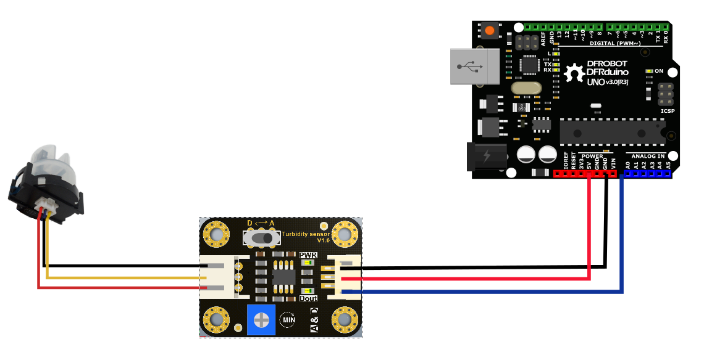
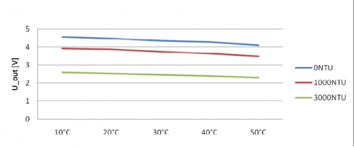

# Introduction

Turbidity sensor detects water quality by measuring the levels of opaqueness. It uses light to detect suspended particles in water by measuring the light transmittance and scattering rate, which changes with the amount of total suspended solids (TSS) in water. 

As the TTS increases, the liquid turbidity level increases. Turbidity sensors are used to measure water quality in rivers and streams, wastewater and effluent measurements, control instrumentation for settling ponds, sediment transport research and laboratory measurements. 


# Wiring



1. VCC:	5v of Arduino
2. GND:	GND of Arduino
3. D/A:	A1 of Arduino
    "A": Analog Signal Output, the output value will decrease when in liquids with a high turbidity
    "D": Digital Signal Output, high and low levels, which can be adjusted by the threshold potentiometer

**NOTE:** We can change the trigger condition by adjusting the threshold potentiometer in digital signal mode.

# Code example

Here are two examples: *Example 1* uses Analog output mode and *Example 2* uses Digital output mode

Example 1

```c
void setup() {
  Serial.begin(9600); //Baud rate: 9600
}
void loop() {
  int sensorValue = analogRead(A0);// read the input on analog pin 0:
  float voltage = sensorValue * (5.0 / 1024.0); // Convert the analog reading (which goes from 0 - 1023) to a voltage (0 - 5V):
  Serial.println(voltage); // print out the value you read:
  delay(500);
}

```

Example 2

```c
int ledPin = 13;                // Connect an LED on pin 13, or use the onboard one
int sensor_in = 2;                 // Connect turbidity sensor to Digital Pin 2

void setup(){
  pinMode(ledPin, OUTPUT);      // Set ledPin to output mode
  pinMode(sensor_in, INPUT);       //Set the turbidity sensor pin to input mode
}

void loop(){
  if(digitalRead(sensor_in)==LOW){       //read sensor signal
    digitalWrite(ledPin, HIGH);   // if sensor is LOW, then turn on
  }
  else{
    digitalWrite(ledPin, LOW);    // if sensor is HIGH, then turn off the led
  }
}

```

This is a reference chart for the mapping from the output voltage to the NTU according to different temperature. e.g. If you leave the sensor in the pure water, that is NTU < 0.5, it should output “4.1±0.3V” when temperature is 10~50℃.



**NOTE:** In the diagram, the unit measuring turbidity is shown as NTU, also it is known as JTU (Jackson Turbidity Unit), 1JTU = 1NTU = 1 mg/L. Refer to [Turbidity wikipedia](https://en.wikipedia.org/wiki/Turbidity).

# Further documentation

Documentation for this sensor is available [here](https://wiki.dfrobot.com/Turbidity_sensor_SKU__SEN0189).

# Specifications

- Operating Voltage: 5V DC
- Operating Current: 40mA (MAX)
- Response Time : <500ms
- Insulation Resistance: 100M (Min)
- Output Method:
    - Analog output: 0-4.5V
    - Digital Output: High/Low level signal (you can adjust the threshold value by adjusting the potentiometer)
- Operating Temperature: 5℃~90℃
- Storage Temperature: -10℃~90℃
- Weight: 30g
- Adapter Dimensions: 38mm*28mm*10mm/1.5inches *1.1inches*0.4inches
