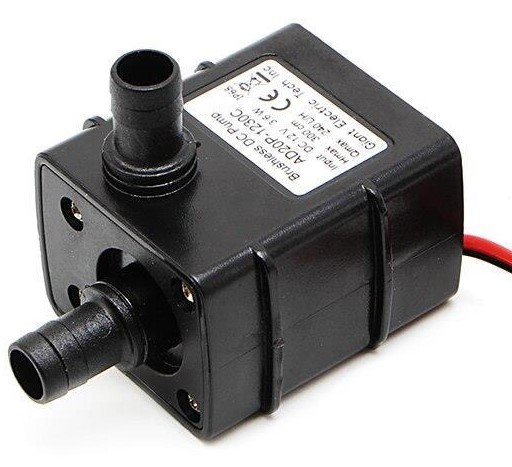

# Introduction

This is mostly used for pumping water in or out of tanks, acquaponics, irrigation and related systems.
                    


                 
# Connecting to Arduino


Relay interface:
1. VCC(+): Connect to 5v port of Arduino (voltage is 5V)
2. GND(-): Connect to the negative/ground line of Arduino
3. OUT(A): Connect to any Arduino digital pin(2 in this case)
4. Com(Common): Connects to positive line of the 12V power supply
5. No(Normally Open): Connects to positive line of pump
6. Ground of the 12V power supply connects to ground of pump
                    
# Code example

```c
/********************
 *  Program:  Water Pump Sample Code
 ********************/


// constants won't change
const int RELAY_PIN = 2;  // the Arduino pin, which connects to the IN pin of relay

// the setup function runs once when you press reset or power the board
void setup() {
  // initialize digital pin 2 as an output.
  pinMode(RELAY_PIN, OUTPUT);
}

// the loop function runs over and over again forever
void loop() {
  digitalWrite(RELAY_PIN, HIGH); // turn on pump 10 seconds
  delay(10000);
  digitalWrite(RELAY_PIN, LOW);  // turn off pump 10 seconds
  delay(10000);
}

```

# Further documentation

See [here](https://arduinogetstarted.com/tutorials/arduino-controls-pump) for further Documentation.