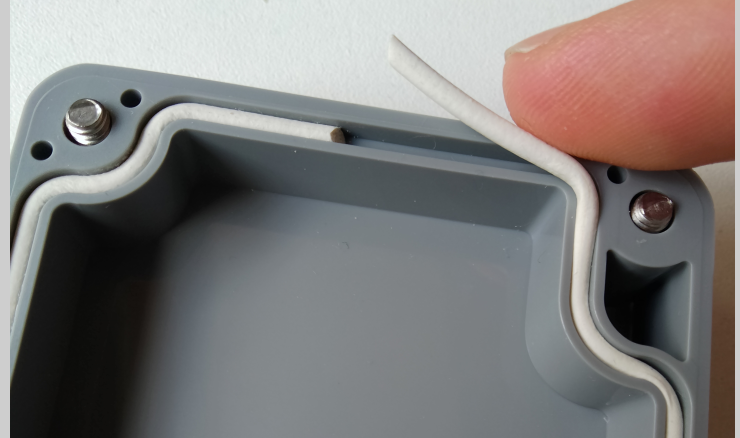
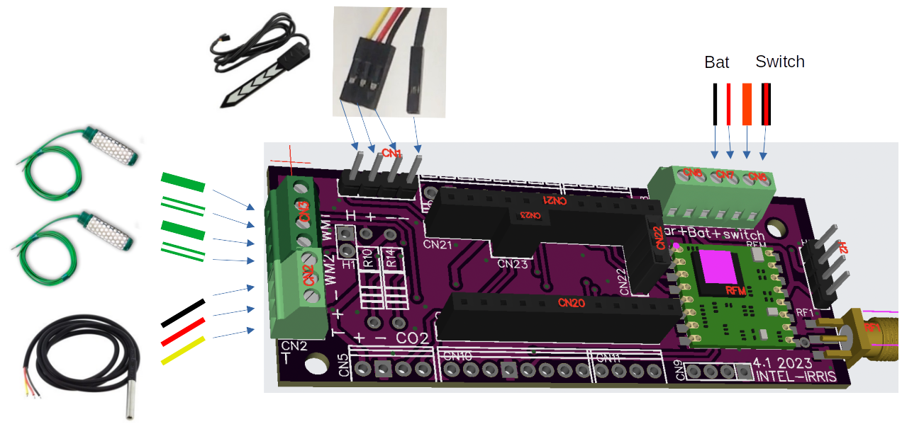

Step #1: Setting up the Device
==============================
Now that all the required components are in your hands, you can start building the device. 
The following [Intel-IrriS video](https://youtu.be/zcazzDbXvHk) showing how to build the outdoor LoRa IoT soil sensor device will guide you to build the prototype.

<!--  -->
<youtube>zcazzDbXvHk</youtube>

[comment]: # ";
2. Install the case waterproof joint;

   Just place it in the case groove and adjust its size to the perimeter.

   

3. Install the switch and cable gland;

   The joint (red arrow in figure) for the cable gland is optional but recommended. Do not close the cable gland with its hat, because it would bend its teeth, ensuring imperviousness, before passing cables through it.

   The switch has a water-proof rubber cap which should be carefully tightened. The inner nut between the switch box and the case (green) allows to tighten the switch correctly.

   Check the switch is correctly placed. The pin closest to the cable gland is not connected, the switch is open when pointing away from the gland, closed (ON) when pointing to the cable gland.

   

4. Connect the switch and the battery holder to the PCB;

   Both battery holder and switch have their dedicated screwed connector on the 
   PCB:

   

5. Connect the sensors' wires to the PCB;
 
 

    Pass the wire through the cable gland and screw or plug them to their dedicated slot on the PCB:

    NB: connecting a watermark and a capacitive on the same device is out of the scope of Intel-IrriS; use two devices for this case.

    For the watermarks, it is recommended to add a domino connector in order to be able to change the sensor without openning the case and unscrewing the cables inside.
 

6. Solder 2 MM wires to the solar panel and connect them to the PCB;

   This step is only necessary for devices with a Solar panel. The point to note here is that since the cover is drilled you need to renforce the protection against water by completely gluing the solar panel perimeter and center on it.

  

7. Connect H2 pins according to battery type;

   The full version (PCBA) comes with the solar charging circuit, but you can still power it with 2 alkaline AA batteries without using a solar panel to avoid external fragile parts. You can select between `solar charging with NiMh batteries` or `no solar charging with 2 alkaline AA batteries`. You can use 2 FF jumper wires instead of the jumpers for the case of the NiMh batteries. 

8. Connect the antenna;
   - Screw the antenna in all the way.
   - Waterproof the junction using flat silicon seals or silicon joint sealant.

Step #2: Programming the Device
============================================

 

### Set up the libraries
The Arduino folder you downloaded and extracted contains a *libraries* sub-folder. In order to make the IDE find and use these libraries, you need to choose the Arduino folder as your sketchbook:

**Go** to `File > Preferences` and **Browse** to choose the Arduino folder as your sketchbook location.

Once done, the IDE will probably ask you to update these libraries:

**Don't do that**, since the Device's code has been validated with this specific version of the compagnion libraries, and is not guaranteed to work with new updates and changes that could be implied.

**Open** the `Arduino/Intelirris_Soil_Sensor.ino` sketch.

### Choose the board and CPU

You need to attach your IDE's window to the Device's board type and CPU:

- Tools > Boards > Arduino AVR Boards > Arduino Pro or Pro Mini
- Tools > Processor > ATmega328P (3.3V, 8 MHz)

### Set up the code
The code is distributed on various C++ modules beside the main INO file. The project encompasses many options regarding different hardware, sensors, radio management, formats, etc. In the scope of Intel-IrriS and this program, you will need to adjust the following files:
- BoardSettings.h
	- **Check** that `#define IRD_PCB` is uncommented (Remove the `//` comment mark if necessary);
	- **Check** that `#define IRD_PCBA` is uncommented (Remove the `//` comment mark if necessary);
	- for devices with a solar panel, **Check** that `#define SOLAR_BAT` is uncommented (Remove the `//` comment mark if necessary).
- RadioSettings.h
	- **Check** that `#define SX127X` is the only uncommented option. The SX127X corresponds to the family of ICs of which the chosen chipsets include a member, or a clone from HopeRF manufacturer.
- Intelirris_Soil_Sensor.ino
	- **Choose** `#define EU868`, `#define EU433`, or the adequate row according to the frequency band you are going to use, as the only uncommented option. Choose this frequency regarding your regional setting and the device's hardware you gathered;
	- for devices with one or two watermarks (W, WT, 2WT types), **uncomment** `#define WITH_WATERMARK`;
	- for devices with two watermarks (2WT types), **uncomment** `#define TWO_WATERMARK`;
	- for devices with a temperature sensor (CT, WT, 2WT types), **uncomment** `#define SOIL_TEMP_SENSOR`.

The code is thought to be generic, i.e. the same for all the Intel-IrriS devices. However, when deploying several devices at the same location, one needs to distinguish their data. In order to identify the devices, the radio frames include a device's address.

Two default (generic) addresses are coded in  `Intelirris_Soil_Sensor.ino`: *26011DAA* for capacitive devices (C or CT), *26011DB1* for watermark devices (W, WT, or 2WT). 

You should **identify extra capacitive devices** using addresses *26011DAB*, *26011DAC*, ..., *26011DAF*. To do so, amend the `Intelirris_Soil_Sensor.ino` program:\
`unsigned char DevAddr[4] = {0x26, 0x01, 0x1D, 0xAA};`
should become for instance:\
`unsigned char DevAddr[4] = {0x26, 0x01, 0x1D, 0xAD};` for the third extra capacitive device.

You should **identify extra watermark devices** using addresses *26011DB2*, *26011DB3*, ..., *26011DBF*. To do so, amend the `Intelirris_Soil_Sensor.ino` program:\
`unsigned char DevAddr[4] = {0x26, 0x01, 0x1D, 0xB1};`
should become for instance:\
`unsigned char DevAddr[4] = {0x26, 0x01, 0x1D, 0xB8};` for the seventh extra watermark device.

[comment]: # "	* for devices without a watermark sensor, the default device address is . If you prepare a deployment involving several devices "

[comment]: # "unsigned char DevAddr[4] = {0x26, 0x01, 0x1D, 0xAA};"
[comment]: # "unsigned char DevAddr[4] = {0x26, 0x01, 0x1D, 0xB1};"
	

Step #3: Debugging the Device
============================================

Most of the issues we faced during the course of Intel-IrriS were addressed (as far as we know, and until new issues get detected).
Nonetheless, I list here the most recurrent issues and how to diagnose and solve them.

## Primary batteries (case without solar panel) 
Most issues are related with the capability of the batteries to powering the device on long-term. 

The cheapest AA batteries will work a few hours and then the device will stop. 
Indeed, the radio transmission is the power-hungriest step of the device's activity. When too little energy remains in the batteries, the voltage decreases during high power demand, below the minimum value tolerated by the microcontroller (around 2.7&thinsp;V), therefore the Arduino shuts down and reboots.

- **Check** that your device behaves as expected when powered using the FTDI32 connector. See previous Section **Check your Device**;
- **Check** that your batteries are "heavy duty" AA Alkaline (LR06).

Note that the voltage is not always a good indicator for the batteries' health. A battery can maintain nominal voltage until a high current demand, such as the radio transmission, makes it drop.

There is a debug mode for the voltage, using the capability of the processor to measure voltage itself:

**Compile and upload** the code having `#define TEST_LOW_BAT` uncommented (Remove the `//` comment mark if necessary).
In that case, the sleep time is reduced to 1 minute (this can be modified) to ease the debugging; the voltage at the end of the sleep period, during and after the transmission are reported, both on serial console and in the next radio frame.

## Device does not switch on
- **Check** that you correctly connect the PCB's H2 header pins according to battery type.
- **Check** with a volt-meter that the switch cabling is not inverted. There should be no tension between the switch screw terminal screws when switch is off.

## Code configuration mismatch
- Check the code, following Section **Set up the code**. Does it match the sensor type and the version of PCB?
- Does the chosen frequency band match the antenna and chipset?

## Bad sensor connecion
- **Check** wires. Note that a dry watermark gives a default value of 3276.

## Other bugs
If you assume an issue may come from the batteries, you can have both battery powering and a serial connection via the FTDI32. From the 6 pins of the Arduino header, connect 5: **disconnect the VCC pin**. You can then analyze the Serial trace. 

Step #4: Setting up the Gateway
============================================

After building, programming and deploying the intel-IRRIS device you need to set up the gateway to prform data transmission.

Follow the instructions of the [slides](https://github.com/CongducPham/PRIMA-Intel-IrriS/blob/main/Tutorials/Intel-Irris-gateway-outdoor.pdf)
and the following tutorial. 

<youtube>j-1Nk0tv0xM</youtube>

<!-- [] -->

