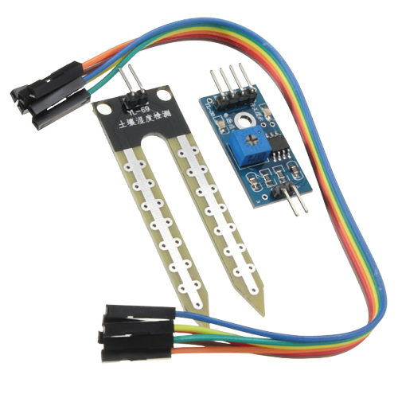
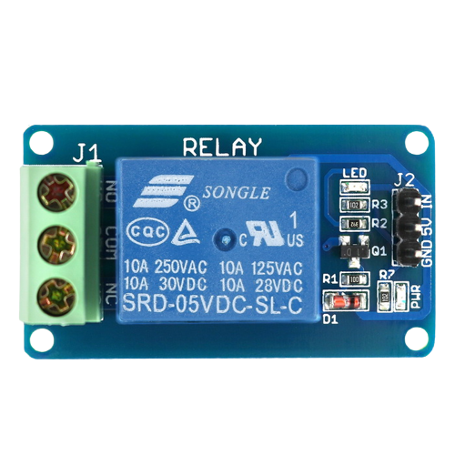
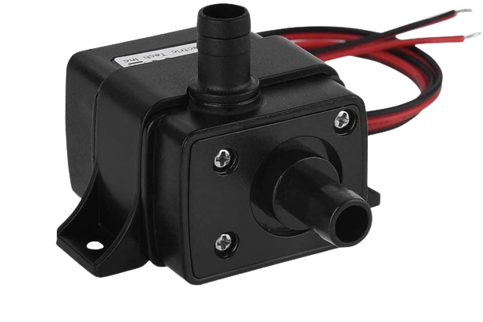
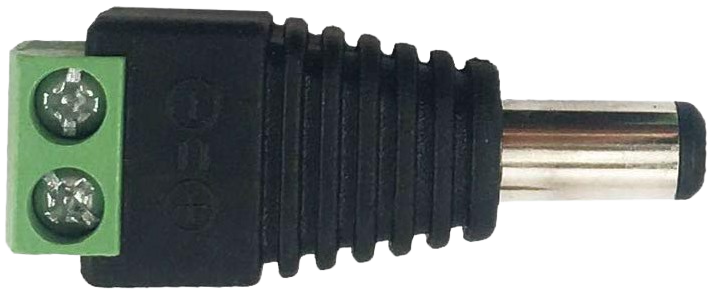
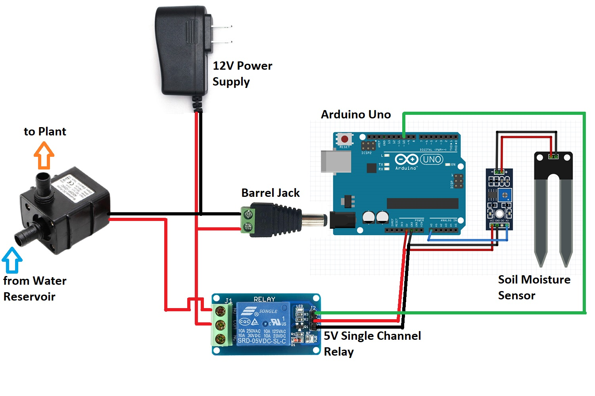

Overview
========

As you may already know, plants require water, light(usually sunlight), nutrients etc,...to grow healthy. While these factors can be easily provided, the problem is usually forgetfulness.

Luckily for us, we can use smart electronic devices to automate some of the above mentioned entities required for plant growth, specifically watering.

Here's what we will be learning:
- What parts are needed
- How to wire up and read sensor values
- How to wire up and trigger an actuator
- How to use the actuator to control a water pump

What parts do we need?
=====================

To follow this user manual, one will need the following hardware:

Hardware
  - an Arduino Uno with USB Cable
  - Soil Moisture Sensor
  - 5v Single Channel Relay
  - Submersible Water Pump
  - Some Jumper Wires
  - Power Supply







Software
  - In terms of software, you need to intall the [Arduino IDE](https://www.arduino.cc/en/Main/Software) for the programming aspects.

**Step \#1:** Setting up the Soil Moisture Sensor
==============================
Soil moisture sensors measures the amount of water in the soil to maintain consistent and ideal soil conditions for plants.
They can be used to detect the moisture of soil or judge if there is water around the sensor. They can be very easy to use, 
just insert it into the soil and then read it.

Schematics
----------
There are only three pins that you need to worry about on most of these analog soil humidity sensors. The common principle is to power the sensor and get the output voltage on an analog pin. In our case, we are going to use pin A0.


Module interface:
1. VCC: Connect to the 5v pole of the Arduino
2. GND: Connect to the GND pole of the Arduino
3. IN: Connect to Arduino analog pin A0

Code Sample
-----------
```c
/********************
 * Soil Moisture Tester
 * Read soil humidity by measuring its resistance.
 ********************/

int sensorPin = A0;

void setup() {
  Serial.begin(38400);

}

void loop() {
  int soilHumidity = analogRead(sensorPin);
  Serial.println(soilHumidity);
  delay(100);
}
```

**Step \#2:** Setting up the Actuator(Relay)
============================================

You may occasionally wish your Arduino to manage appliances with AC power, such as lamps, fans, and other home appliances. The Arduino, however, cannot directly control these higher voltage devices because it runs on 5 volts.

This is where the relay comes into play. You can use an Arduino to control the relay and the relay module to control the AC mains. In our case, we are controlling the 12 Volts supply of a water pump.
                                 
Schematics
----------


Module interface:
1. VCC: Connect to the 5v pole of the Arduino
2. GND: Connect to the GND pole of the Arduino
3. IN: Connect to Arduino control pin 10

Code Sample
-----------
```c
/********************
 *  Program:  Relay Tester
 ********************/

//Declaring pin 10 as the control pin    
int RelayPin = 10;

void setup() {
  //Set RelayPin as an output pin
  pinMode(RelayPin, OUTPUT);
}

void loop() {
  // Let's turn on the relay...
  digitalWrite(RelayPin, LOW);

  //Lets wait for 5 seconds
  delay(5000);
	
  //Let's turn off the relay...
  digitalWrite(RelayPin, HIGH);

  //Lets wait for another 5 seconds
  delay(5000);
}
```
**Step \#3:** Combining Sensing and Actuation for Automation
============================================================

At this point, we want to trigger the relay to turn ON the water pump, when the soil moisture sensor detects a dry soil. The relay will then turn OFF when the soil moisture sensor reports the soil is wet.

Extra Hardware Needed
  - 12v Male Barrel Jack
   


Schematics
----------


Code Sample
-----------
```c
/********************
 *  Program:  Automatic Irrigation
 ********************/

//Declaring pin 10 as the control pin
int RelayPin = 10;

//Declaring pin A0 moisture sensing pin
int sensorPin = A0;

//Declaring dry and wet soil threshold values
int const dryThreshold = 800;
int const wetThreshold = 350;

void setup() {
  //Set RelayPin as an output pin
  pinMode(RelayPin, OUTPUT);
}

void loop() {
  //Read the soil moisture level
  int soilHumidity = analogRead(sensorPin);

  //Check if the soil moisture value is a number
  if (!(isnan(soilHumidity))) {
    if (soilHumidity > dryThreshold) { //Turn Pump ON
      digitalWrite(RelayPin, HIGH);
    } else if (soilHumidity <= wetThreshold) { //Turn Pump OFF
      digitalWrite(RelayPin, LOW);
    }
  }

  //Wait 5 seconds between reads/executions
  delay(5000);
}
```