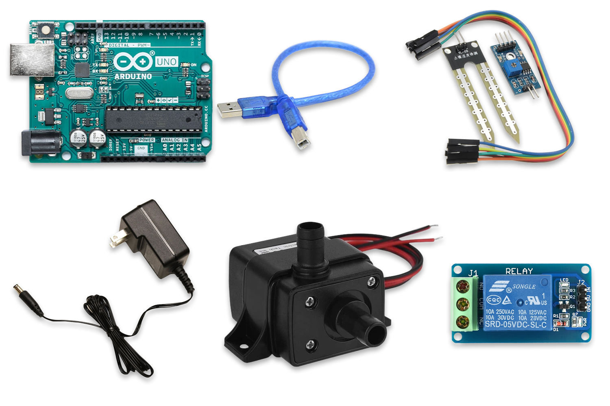

Overview
========

As you may already know, plants require water, light (usually sunlight), nutrients etc, ... to grow healthy. While these factors can be easily provided, the problem is usually forgetfulness.

Luckily for us, we can use smart electronic devices to automate some of the above mentioned entities required for plant growth, specifically watering.

Here's what we will be learning:
- What parts are needed
- How to wire up and read sensor values
- How to trigger an actuator
- How to use the actuator to control a water pump
- How to communicate to the cloud over LoRa

What parts do we need?
======================

To follow this user manual, one will need the following hardware:

Hardware
  - WaziAct
  - FT232 FTDI module with Mini USB Cable
  - Wazigate
  - Soil Moisture Sensor
  - Submersible Water Pump
  - Some Jumper Wires
  - Power Supply

Software
  - Please install the [Arduino IDE](https://www.arduino.cc/en/Main/Software) for the programming aspects.
  - Install the [WaziDev](https://github.com/Waziup/WaziDev/archive/master.zip) libraries for LoRa communication. Follow the guide [here](https://waziup.io/documentation/wazidev/user-manual/#install-the-wazidev-sketchbook)