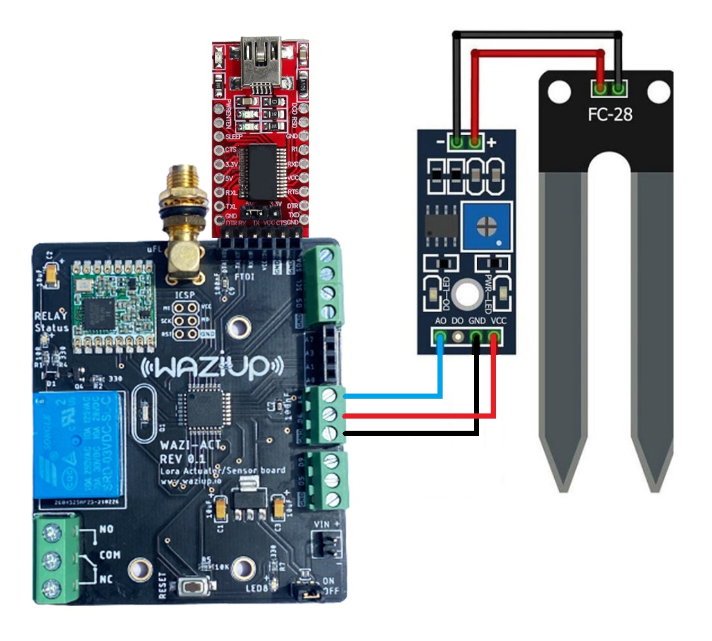
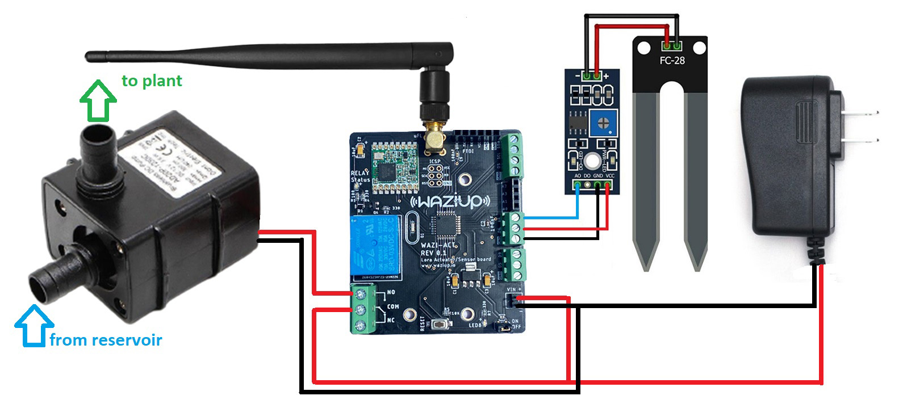

---
---


Step #1: Setting up the Soil Moisture Sensor
==============================
Soil moisture sensors measures the amount of water in the soil to maintain consistent and ideal soil conditions for plants.
They can be used to detect the moisture of soil or judge if there is water around the sensor. They can be very easy to use, 
just insert it into the soil and then read it.

Schematics
----------
There are only three pins that you need to worry about on most of these analog soil humidity sensors. The common principle is to power the sensor and get the output voltage on an analog pin. In our case, we are going to use pin A6.



NOTE: we are powering the soil moisture sensor from **pin D6**. Each digital pin can with stand **40mA** max current draw. The soil moisture sensor is rated for **35mA**.

Module interface:
1. VCC: Connect to the D6 pin of the WaziACT
2. GND: Connect to the GND pin of the WaziACT
3. IN: Connect to the WaziACT analog pin A6

Code Sample
-----------
```c
/********************
 * Soil Moisture Tester
 * Read soil humidity by measuring its resistance.
 ********************/

int sensorPin = A6;
int sensorPow = 6;

void setup() {
  Serial.begin(38400);
  pinMode(sensorPow, OUTPUT);
  delay(100);
  digitalWrite(sensorPow, HIGH);
}

void loop() {
  int soilHumidity = analogRead(sensorPin);
  Serial.println(soilHumidity);
  delay(100);
}
```

Step #2: Setting up the Actuator(Relay)
============================================

You may occasionally wish to manage appliances with AC power, such as lamps, fans, and other home appliances. The WaziACT, however, cannot directly control these higher voltage devices because it runs on 3.3 volts.

This is where the relay comes into play.The waziACT has a relay module to control the AC mains. In our case, we are controlling the 12 Volts supply of a water pump.

Code Sample
-----------
```c
/********************
 *  Program:  Relay Tester
 ********************/

//Declaring pin 10 as the control pin    
int RelayPin = 7;

void setup() {
  //Set RelayPin as an output pin
  pinMode(RelayPin, OUTPUT);
}

void loop() {
  // Let's turn on the relay...
  digitalWrite(RelayPin, LOW);

  //Lets wait for 5 seconds
  delay(5000);
	
  //Let's turn off the relay...
  digitalWrite(RelayPin, HIGH);

  //Lets wait for another 5 seconds
  delay(5000);
}
```


Step #3: Combining Sensing and Actuation with Lora Communication
====================================================================================

At this point, we want to trigger the relay to turn ON the water pump, when the soil moisture sensor detects a dry soil. The relay will then turn OFF when the soil moisture sensor reports the soil is wet. Also the WaziACT will constantly update Wazicloud with the current state of the soil through Wazigate.

**NOTE:** Make sure to have a configured gateway up and running before uploading this next code. Kindly see the lectures under **Module 5 Lecture 2** for how to setup a Waziup Gateway.

Schematics
----------


Code Sample
-----------
```c
#include <WaziDev.h>
#include <xlpp.h>
#include <Base64.h>

// NwkSKey (Network Session Key) and Appkey (AppKey) are used for securing LoRaWAN transmissions.
// You need to copy them from/to your LoRaWAN server or gateway.
// You need to configure also the devAddr. DevAddr need to be different for each devices!!
// Copy'n'paste the DevAddr (Device Address): 26011D00
unsigned char devAddr[4] = {0x26, 0x01, 0x1D, 0x00};

// Copy'n'paste the key to your Wazigate: 23158D3BBC31E6AF670D195B5AED5525
unsigned char appSkey[16] = {0x23, 0x15, 0x8D, 0x3B, 0xBC, 0x31, 0xE6, 0xAF, 0x67, 0x0D, 0x19, 0x5B, 0x5A, 0xED, 0x55, 0x25};

// Copy'n'paste the key to your Wazigate: 23158D3BBC31E6AF670D195B5AED5525
unsigned char nwkSkey[16] = {0x23, 0x15, 0x8D, 0x3B, 0xBC, 0x31, 0xE6, 0xAF, 0x67, 0x0D, 0x19, 0x5B, 0x5A, 0xED, 0x55, 0x25};

WaziDev wazidev;

//Declaring pin 7 as the control pin
int RelayPin = 7;

//Sensor Power Pin
int sensorPow = 6;

//Declaring pin A0 moisture sensing pin
int sensorPin = A6;

//Declaring dry and wet soil threshold values
int const dryThreshold = 800;
int const wetThreshold = 350;

void setup()
{
  Serial.begin(38400);
  wazidev.setupLoRaWAN(devAddr, appSkey, nwkSkey);

  pinMode(RelayPin, OUTPUT);
  pinMode(sensorPow, OUTPUT);
  delay(100);
  digitalWrite(sensorPow, HIGH);
}

XLPP xlpp(120);

void loop(void)
{
  int soilHumidity = analogRead(sensorPin);

  //Check if the soil moisture value is a number
  if (!(isnan(soilHumidity))) {
    if (soilHumidity > dryThreshold) { //Turn Pump ON
      digitalWrite(RelayPin, HIGH);
    } else if (soilHumidity <= wetThreshold) { //Turn Pump OFF
      digitalWrite(RelayPin, LOW);
    }
  }
  
  // 1
  // Create xlpp payload.
  
  xlpp.reset();
  
  xlpp.addRelativeHumidity(1, soilHumidity);
  
  // 2.
  // Send paload with LoRaWAN.
  serialPrintf("LoRaWAN send ... ");
  uint8_t e = wazidev.sendLoRaWAN(xlpp.buf, xlpp.len);
  if (e != 0)
  {
    serialPrintf("Err %d\n", e);
    delay(60000);
    return;
  }
  serialPrintf("OK\n");
  
  // 3.
  // Receive LoRaWAN message (waiting for 6 seconds only).
  serialPrintf("LoRa receive ... ");
  uint8_t offs = 0;
  long startSend = millis();
  e = wazidev.receiveLoRaWAN(xlpp.buf, &xlpp.offset, &xlpp.len, 6000);
  long endSend = millis();
  if (e != 0)
  {
    if (e == ERR_LORA_TIMEOUT){
      serialPrintf("nothing received\n");
    }
    else
    {
      serialPrintf("Err %d\n", e);
    }
    delay(60000);
    return;
  }
  serialPrintf("OK\n");
  
  serialPrintf("Time On Air: %d ms\n", endSend-startSend);
  serialPrintf("LoRa SNR: %d\n", wazidev.loRaSNR);
  serialPrintf("LoRa RSSI: %d\n", wazidev.loRaRSSI);
  serialPrintf("LoRaWAN frame size: %d\n", xlpp.offset+xlpp.len);
  serialPrintf("LoRaWAN payload len: %d\n", xlpp.len);
  serialPrintf("Payload: ");
  char payload[100];
  base64_decode(payload, xlpp.getBuffer(), xlpp.len); 
  serialPrintf(payload);
  serialPrintf("\n");
  
  delay(5000);
}
```

At this point, all we need to do is drop the water pump in a water resevoir and attach a pipe to the outlet of the pump, to the plant.

we can also setup notifications on WaziCloud, for when the relay turns ON or OFF. We can use the soil figures we used in the previous example. That is `800` for dry soil(Relay ON) and `350` for a wet soil(Relay OFF).