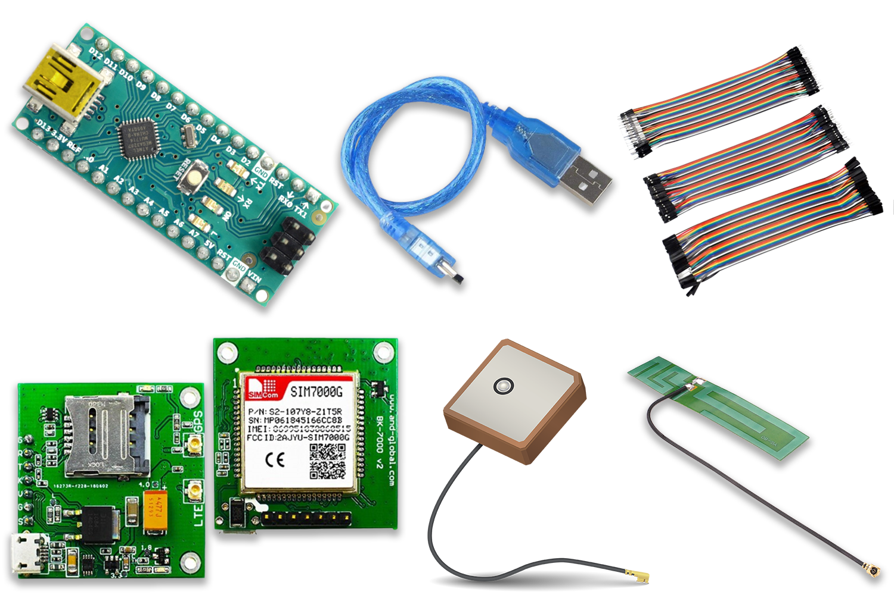

Overview
========
Cattle rustlings is increasingly becoming a major problem in many parts of Africa in recent years. Despite the growing level of cattle theft and its consequences for society, the situation has yet to receive an effective intervention.

In this guided article we will look at how to build a simple tracking solutions for livestock using a method known as **Geofencing**.

Here's what we will be learning:
- What Geofencing means and how it works
- What parts are needed
- How to read and process GPS data
- How to track objects with Geofencing
- How to transmit data collected using LoRa

What parts do we need?
=====================

To follow this user manual, one will need the following hardware:

Hardware
  - Wazidev with USB Mirco Cable
  - Neo M8/7/6 GPS Breakout Board
  - Active Ceramic GPS Antenna
  - LoRa Gateway with Internet
  - Some Jumper Wires
  - LiPo/Li-ion Battery with Holder
  


Software
  - Install the [Arduino IDE](https://www.arduino.cc/en/Main/Software) for the programming aspects.
  - Install [TinyGPSPlus](https://github.com/mikalhart/TinyGPSPlus) library by **Mikal Hart**
  - Install the [WaziDev](https://github.com/Waziup/WaziDev/archive/master.zip) libraries for LoRa communication. Follow the guide [here](https://waziup.io/documentation/wazidev/user-manual/#install-the-wazidev-sketchbook)

**Step \#1:** Installing TinyGPS Plus Library
=============================================
Under the **Sketch** menu in the Arduino IDE, locate **Include Libraries** and navigate to **Manage Libraries..** and click to open the libraries manager.


Search for **"tinygpsplus"** in the search box and install the version by **Mikal Hart** as shown below


After installing we should see the label **INSTALLED** as shown below.


We can now close the library manager.

**Step \#2:** Reading and Processing GPS Coordinates
====================================================
In order to be sure our GPS sensor works, we need to atleast see some raw GPS data containing latitute, longitude, altitude etc...
To do that we need to wire up our GPS breakout board to the Wazidev UART pins and run some basic GPS code.

We will have to use **Software Serial** to define a diffent set of pins for UART to interface the GPS with the wazidev
  
Schematics
----------


Module interface:
1. VCC: Connect to the 3.3V(VCC) pin of the wazidev
2. GND: Connect to the GND pin of the wazidev
3. TX: Connect to pin 10 of the wazidev
4. RX: No need to connect to pin 11 as we wont be sending any commands to the GPS board

Code Sample
-----------

````c
#include <TinyGPS++.h>
#include <SoftwareSerial.h>

//Declaring pin 10 as recieve and 11 as Transmit
static const int RXPin = 10, TXPin = 11;

//Setting GPS communication Speed to default of NEO-M8 board
static const uint32_t GPSBaud = 9600;

//Creating GPS Object
TinyGPSPlus gps;

//Activating serial communication
SoftwareSerial ss(RXPin, TXPin);

void setup() {
  Serial.begin(38400);

  //Start listening for GPS Data
  ss.begin(GPSBaud);
}

void loop() {
    //When GPS data is available.
  while (ss.available() > 0)
    if (gps.encode(ss.read()))
      displayInfo();

  //When there's an error
  if (millis() > 5000 && gps.charsProcessed() < 10)
  {
    Serial.println(F("No GPS detected: check wiring."));
    while(true);
  }
}

void displayInfo(){
  //When new GPS data is correctly encoded/processed.
  if(gps.satellites.isValid() && gps.location.isValid() && gps.altitude.isValid() ){
     Serial.print(F("Sats: "));
     Serial.print(gps.satellites.value());
     Serial.print(F(" Location: "));
     Serial.print(gps.location.lat(), 6);
     Serial.print(F(" "));
     Serial.print(gps.location.lng(), 6);
     Serial.print(F(" Altitude: ")); 
     Serial.println(gps.altitude.meters());
  }else{
    Serial.print(F("INVALID"));
  }

}
````

**NOTE:** It takes a while to obtain an accurate GPS lock on the location of the board. Could take anywhere from seconds to several minutes for values to begin showing up in the serial monitor in this form

**Sats:** vvvvv **Location:** xxxxx yyyyy **Altitude:** zzzzz

where:
- vvvvv is the number of satelites the tracker sees
- xxxxx is the longitude
- yyyyy is the latitude
- zzzzz is the altitude


**Step \#3:** Tracking Using Geofencing
=======================================

Now that we are able to see the GPS coordinates, the next thing is to set a fixed coordinate and determine how far new coordinates received are from fixed coordinate.
We can do this calculation using the Haversine Formular. The haversine formula can be used to determine the great-circle distance between two points on a sphere given their longitudes and latitudes.


Lets take a look at how to implement the Haversine Formular in our previous GPS code.


**Step \#4:** Transmitting Data of LoRa 
=======================================

**Step \#5:** Final Touches
===========================