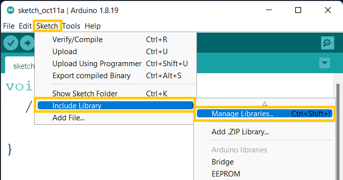
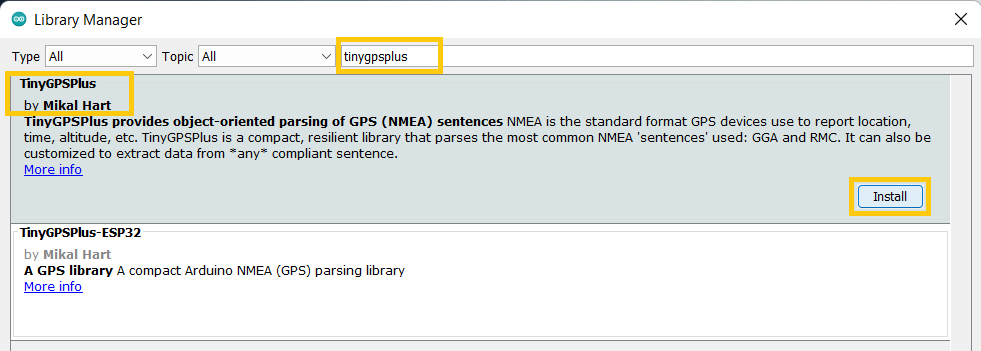
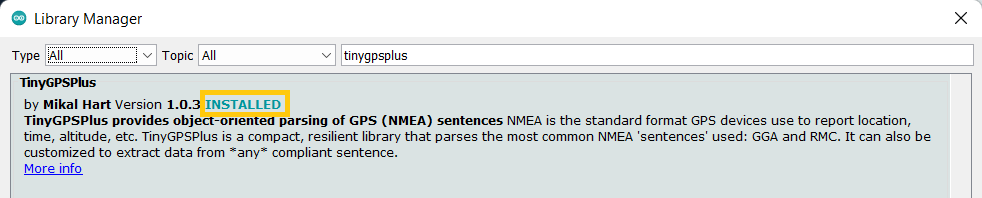
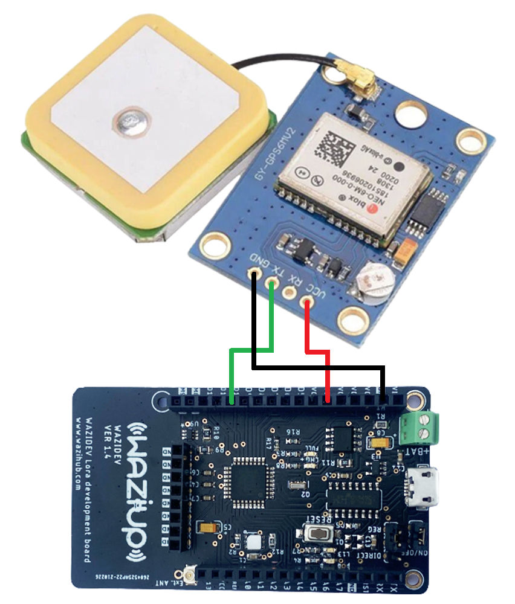
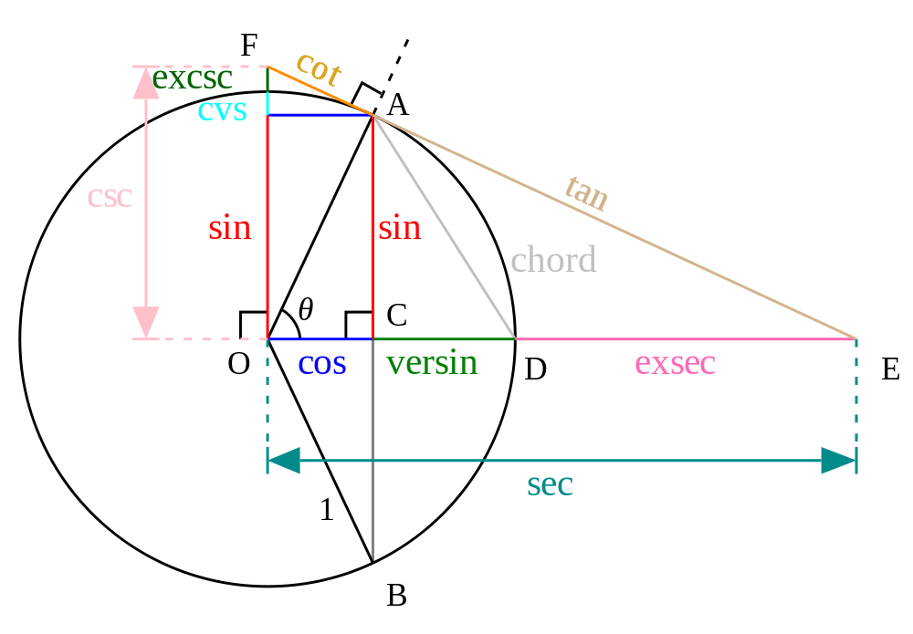
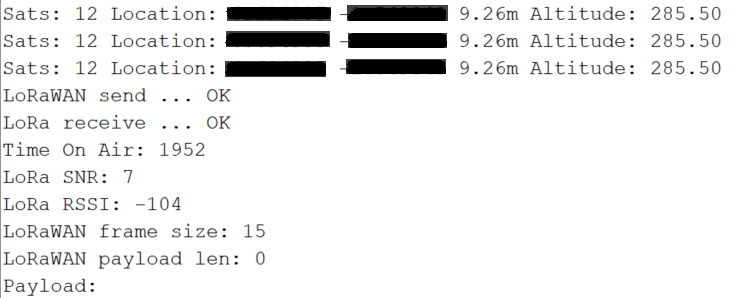
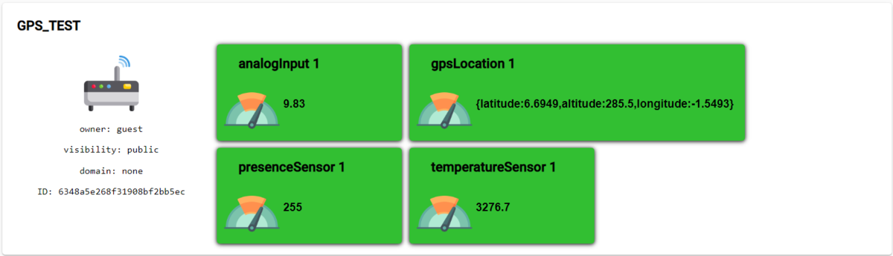
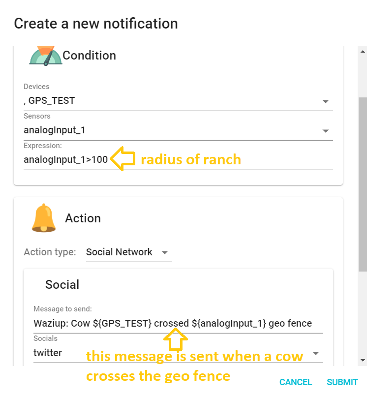

Step #1: Installing TinyGPS Plus Library
=============================================
Under the **Sketch** menu in the Arduino IDE, locate **Include Libraries** and navigate to **Manage Libraries..** and click to open the libraries manager.



Search for **"tinygpsplus"** in the search box and install the version by **Mikal Hart** as shown below



After installing we should see the label **INSTALLED** as shown below.



We can now close the library manager.


Step #2: Reading and Processing GPS Coordinates
====================================================
In order to be sure our GPS sensor works, we need to atleast see some raw GPS data containing latitute, longitude, altitude etc...
To do that we need to wire up our GPS breakout board to the Wazidev UART pins and run some basic GPS code.

We will have to use **Software Serial** to define a diffent set of pins for UART to interface the GPS with the wazidev
  
Schematics
----------


Module interface:
1. VCC: Connect to the 3.3V(VCC) pin of the wazidev
2. GND: Connect to the GND pin of the wazidev
3. TX: Connect to Analog pin AO of the wazidev
4. RX: No need to connect to pin 11 as we wont be sending any commands to the GPS board

Code Sample
-----------

```c
#include <TinyGPS++.h>
#include <SoftwareSerial.h>

//Declaring pin A0 as receive and A1 as Transmit
static const int RXPin = A0, TXPin = A1;

//Setting GPS communication Speed to default of NEO-M8 board
static const uint32_t GPSBaud = 9600;

//Creating GPS Object
TinyGPSPlus gps;

//Activating serial communication
SoftwareSerial ss(RXPin, TXPin);

void setup() {
  Serial.begin(38400);

  //Start listening for GPS Data
  ss.begin(GPSBaud);
}

void loop() {
  //When GPS data is available.
  while (ss.available() > 0)
    if (gps.encode(ss.read()))
      displayInfo();

  //If there's an error
  if (millis() > 5000 && gps.charsProcessed() < 10)
  {
    Serial.println("No GPS detected: check wiring.");
    while(true);
  }
}

void displayInfo() {
  //Checking number of satelites in sight
  if (gps.satellites.isValid()) {
    Serial.print("Sats: ");
    Serial.print(gps.satellites.value());
  } else {
    Serial.println(" INVALID SATELITE");
  }

  //Checking GPS location coordinates
  if (gps.location.isValid()) {
    Serial.print(" Location: ");
    Serial.print(gps.location.lat(), 6);
    Serial.print(" ");
    Serial.print(gps.location.lng(), 6);
  } else {
    Serial.println(" INVALID LOCATION");
  }

  //Checking Altitude/Elivation above sea level
  if (gps.altitude.isValid() ) {
    Serial.print(" Altitude: ");
    Serial.println(gps.altitude.meters());
  } else {
    Serial.println(" INVALID ALTITUDE");
  }

  //wait 1 second between checks
  delay(1000);
}
```

**NOTE:** It takes a while to obtain an accurate GPS lock on the location of the board. This Could take anywhere from seconds to several minutes for values to begin showing up in the serial monitor in this form

**Sats:** vvvvv **Location:** xxxxx yyyyy **Altitude:** zzzzz

where:
- vvvvv is the number of satelites the tracker sees
- xxxxx is the longitude
- yyyyy is the latitude


Step #3: Tracking Using Geofencing
=======================================

Now that we are able to see the GPS coordinates, the next thing is to set a fixed coordinate and determine how far new coordinates received are from fixed coordinate.
We can do this calculation using the Haversine Formular. The haversine formula determines the great-circle distance between two points on a sphere given their longitudes and latitudes.



Lets take a look at how to implement the Haversine Formular in our previous GPS code.

Code Sample
-----------

```c
//Adding GPS and Software Serial Library
#include <TinyGPS++.h>
#include <SoftwareSerial.h>

//Declaring pin A0 as receive and A1 as Transmit
static const int RXPin = A0, TXPin = A1;

//Setting GPS communication Speed to default of NEO-M8 board
static const uint32_t GPSBaud = 9600;

//This is the fixed location's GPS Coordinates(this can be the cattle owners land)
const float fixedlat = xxxxx; // insert your latitude
const float fixedlon = yyyyy; // insert your longitude

//Creating GPS Object
TinyGPSPlus gps;

//Activating serial communication
SoftwareSerial ss(RXPin, TXPin);

void setup() {
  Serial.begin(38400);

  //Start listening for GPS Data
  ss.begin(GPSBaud);
}

void loop() {
  //When GPS data is available.
  while (ss.available() > 0)
    if (gps.encode(ss.read()))
      displayInfo();

  //If there's an error
  if (millis() > 5000 && gps.charsProcessed() < 10)
  {
    Serial.println(F("No GPS detected: check wiring."));
    while (true);
  }
}

void displayInfo() {
  //Checking for number of Valid Satelites in sight
  if (gps.satellites.isValid()) {
    Serial.print("Sats: ");
    Serial.print(gps.satellites.value());
  } else {
    Serial.println(" INVALID SATELITE");
  }

  //Checking GPS location coordinates
  if (gps.location.isValid()) {
    Serial.print(" Location: ");
    float newlat = gps.location.lat();
    float newlon = gps.location.lng();
    float distance = calcDistance(fixedlat, fixedlon, newlat, newlon);
    Serial.print(newlat, 6);
    Serial.print(" ");
    Serial.print(newlon, 6);
    Serial.print(" ");
    Serial.print(distance);
    Serial.print("m");
  } else {
    Serial.println(" INVALID LOCATION");
  }

  //Checking Altitude/Elivation above sea level
  if (gps.altitude.isValid() ) {
    Serial.print(" Altitude: ");
    Serial.println(gps.altitude.meters());
  } else {
    Serial.println(" INVALID ALTITUDE");
  }

  //wait 1 second between checks
  delay(1000);
}

//Calculating distance between fixed coordinates and new coordinates
float calcDistance(float lat1, float lon1, float lat2, float lon2) {
  float dlon, dlat, a, c;
  float dist = 0.0;
  dlon = dtor(lon2 - lon1);
  dlat = dtor(lat2 - lat1);
  a = pow(sin(dlat / 2), 2) + cos(dtor(lat1)) * cos(dtor(lat2)) * pow(sin(dlon / 2), 2);
  c = 2 * atan2(sqrt(a), sqrt(1 - a));

  dist = 6378140.0f * c;  //radius of the earth (6378140 meters) in feet 20925656.2
  return (dist + 0.5);
}

//Convert degrees to radians
float dtor(float fdegrees) {
  return (fdegrees * PI / 180);
}
```

The data from the serial monitor this time would look like this.
**Sats:** vvvvv **Location:** xxxxx yyyyy ddddd **Altitude:** zzzzz

where:
- vvvvv is the number of satelites the tracker sees
- xxxxx is the longitude
- yyyyy is the latitude
- ddddd is the distance between coordinates in meters
- zzzzz is the altitude


Step #4: Transmitting Data using LoRa 
=======================================

To transmit the data collected over LoRa to the cloud, we need a gateway.

NOTE: the Gateway must already be configured and have internet access. For how to setup the Wazidev to communicate with the gateway, be sure to see Module 5 Lecture 1.

At this point we just need to pass on the distance between coordinates to **xlpp.addAnalogInput()** and gps coordinates to **xlpp.addGPS()** functions for transmission to the gateway.

Adding the above functions and making final changes to the code we have:

Code Sample
-----------

```c
//Adding Wazidev Libraries
#include <WaziDev.h>
#include <xlpp.h>
#include <Base64.h>

//Adding GPS and Software Serial Library
#include <TinyGPS++.h>
#include <SoftwareSerial.h>

//Declaring pin A0 as receive and A1 as Transmit
static const int RXPin = A0, TXPin = A1;

//Setting GPS communication Speed to default of NEO-M8 board
static const uint32_t GPSBaud = 9600;

//This is the fixed location's GPS Coordinates(this can be the cattle owners land)
const double fixedlat = xxxxx;
const double fixedlon = yyyyy;

//Creating GPS Object
TinyGPSPlus gps;

//Activating serial communication
SoftwareSerial ss(RXPin, TXPin);

// NwkSKey (Network Session Key) and Appkey (AppKey) are used for securing LoRaWAN transmissions.
// You need to copy them from/to your LoRaWAN server or gateway.
// You need to configure also the devAddr. DevAddr need to be different for each devices!!
// Copy'n'paste the DevAddr (Device Address): 26011D00
unsigned char devAddr[4] = {0x26, 0x01, 0x1D, 0x00};

// Copy'n'paste the key to your Wazigate: 23158D3BBC31E6AF670D195B5AED5525
unsigned char appSkey[16] = {0x23, 0x15, 0x8D, 0x3B, 0xBC, 0x31, 0xE6, 0xAF, 0x67, 0x0D, 0x19, 0x5B, 0x5A, 0xED, 0x55, 0x25};

// Copy'n'paste the key to your Wazigate: 23158D3BBC31E6AF670D195B5AED5525
unsigned char nwkSkey[16] = {0x23, 0x15, 0x8D, 0x3B, 0xBC, 0x31, 0xE6, 0xAF, 0x67, 0x0D, 0x19, 0x5B, 0x5A, 0xED, 0x55, 0x25};

//Creating Wazidev object
WaziDev wazidev;

void setup()
{
  Serial.begin(38400);

  //Start listening for GPS Data
  ss.begin(GPSBaud);

  //Start LoRa Communications
  wazidev.setupLoRaWAN(devAddr, appSkey, nwkSkey);
}

//Create XLPP object
XLPP xlpp(120);

void loop(void)
{
  //When GPS data is available.
  while (ss.available() > 0)
    if (gps.encode(ss.read()))
      displayInfo();

  //If there's an error
  if (millis() > 5000 && gps.charsProcessed() < 10)
  {
    Serial.println("No GPS detected: check wiring.");
    while (true);
  }

  // 2.
  // Send payload with LoRaWAN.
  Serial.print("LoRaWAN send ... ");
  uint8_t e = wazidev.sendLoRaWAN(xlpp.buf, xlpp.len);
  if (e != 0)
  {
    Serial.print("Err ");
    Serial.println(e);
    delay(6000);
    return;
  }
  Serial.println("OK");

  // 3.
  // Receive LoRaWAN message (waiting for 6 seconds only).
  Serial.print("LoRa receive ... ");
  uint8_t offs = 0;
  long startSend = millis();
  e = wazidev.receiveLoRaWAN(xlpp.buf, &xlpp.offset, &xlpp.len, 6000);
  long endSend = millis();
  if (e != 0)
  {
    if (e == ERR_LORA_TIMEOUT) {
      Serial.println("nothing received");
    }
    else
    {

      Serial.print("Err ");
      Serial.println(e);
    }
    delay(6000);
    return;
  }
  Serial.println("OK");

  //Printing Activities on Serial Monitor
  Serial.print("Time On Air: ");
  Serial.println(endSend - startSend);
  Serial.print("LoRa SNR: ");
  Serial.println(wazidev.loRaSNR);
  Serial.print("LoRa RSSI: ");
  Serial.println(wazidev.loRaRSSI);
  Serial.print("LoRaWAN frame size: ");
  Serial.println(xlpp.offset + xlpp.len);
  Serial.print("LoRaWAN payload len: ");
  Serial.println(xlpp.len);
  Serial.print("Payload: ");
  char payload[100];
  base64_decode(payload, xlpp.getBuffer(), xlpp.len);
  Serial.println(payload);
  Serial.println(" ");

  //delay(5000);
}

void displayInfo() {
  //Checking for number of Valid Satelites in sight
  if (gps.satellites.isValid()) {
    Serial.print("Sats: ");
    Serial.print(gps.satellites.value());
  } else {
    Serial.println(" INVALID SATELITE");
  }

  //Checking GPS location coordinates
  float newlat, newlon, distance;
  if (gps.location.isValid()) {
    Serial.print(" Location: ");
    newlat = gps.location.lat();
    newlon = gps.location.lng();
    distance = calcDistance(fixedlat, fixedlon, newlat, newlon);
    Serial.print(newlat, 6);
    Serial.print(" ");
    Serial.print(newlon, 6);
    Serial.print(" ");
    Serial.print(distance);
    Serial.print("m");
  } else {
    Serial.println(" INVALID LOCATION");
  }

  //Checking Altitude/Elivation above sea level
  float alt;
  if (gps.altitude.isValid() ) {
    Serial.print(" Altitude: ");
    alt = gps.altitude.meters();
    Serial.println(alt);
  } else {
    Serial.println(" INVALID ALTITUDE");
  }

  //1
  // Create xlpp payload.
  xlpp.reset();
  xlpp.addGPS(1, newlat, newlon, alt);
  xlpp.addAnalogInput(1, distance);

  //wait 1 second between checks
  //delay(1000);
}

//Calculating distance between fixed coordinates and new coordinates
float calcDistance(float lat1, float lon1, float lat2, float lon2) {
  float dlon, dlat, a, c;
  float dist = 0.0;
  dlon = dtor(lon2 - lon1);
  dlat = dtor(lat2 - lat1);
  a = pow(sin(dlat / 2), 2) + cos(dtor(lat1)) * cos(dtor(lat2)) * pow(sin(dlon / 2), 2);
  c = 2 * atan2(sqrt(a), sqrt(1 - a));

  dist = 6378140.0f * c;  //radius of the earth (6378140 meters) in feet 20925656.2
  return (dist + 0.5);
}

//Convert degrees to radians
float dtor(float fdegrees) {
  return (fdegrees * PI / 180);
}
```

We will see the following from the serial monitor:



The gateway will also display our distance under analogInput1 and GPS under gpsLocation1


The correspongind data on the gateway will be mirrored on the WaziCloud as well.




Step #5: Final Touches
===========================

At this point we need to setup a notification for when the value of **analogInput1** goes above a certain threshold. The threshold in question can be the radius of the cattle ranch land.

If we assume a range radius of **100m** for this example. This is what our notification settings would look like.



Kindly see Module 5 Lecture 3 for further details on how to setup notifications on Wazicloud.

Cheers!!
