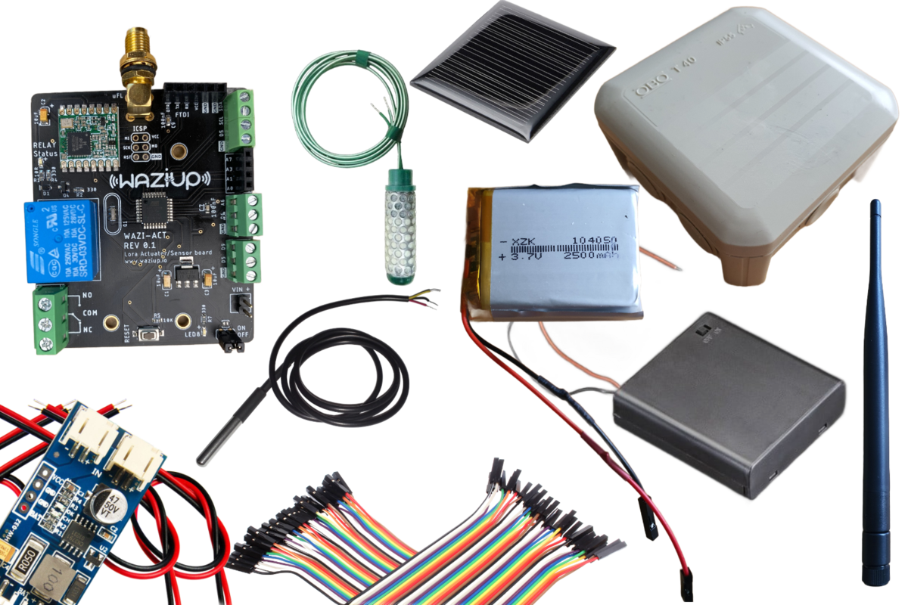

Overview
========

With the help of this guide you will be able to build a device to track moisture and soil temperature. We use it to collect data for different purposes. [Congduc Pham](https://cpham.perso.univ-pau.fr) created similar devices for the [Intel-Irris Project](https://intel-irris.eu), they also got a [github repository](https://github.com/CongducPham/PRIMA-Intel-IrriS). In the OSIRRIS we want to create a dataset, to automate irrigation for a farm. Therefore we use a slightly different configuration to meet the requirements. 

Here's what we will be learning:
- What parts are required
- How to wire up and read sensor values
- How to connect to WaziGate
- How to communicate to the cloud over LoRa
- 

What parts are required?
======================

The following hardware and software is required in order to follow this user guide:

**Hardware:**
- Waziact Board
- Antenna
- Wires and jumpers
- Watermark Sensor (Irrometer)
- DS18B20 temperature sensor 
- 10kOhm resistor, for the Watermark
- 4.7kOhm resistor, for the DS18B20
- (OLED screen)
- Waterproof casings (minimum: IP 55)
- FTDI connector + USB cable
- Ordinary 2-way switch 
- Powering:
  1) Option:
      - 4x AA battery holder 
      - 4x 1,5V AA battery 
  2) Option:
      - MPPT solar charge controller
      - Solar panel 5V, 0,3W 
      - 3,7V LiPo battery with 2500mAh

**Software:**
  - Please install the [Arduino IDE](https://www.arduino.cc/en/Main/Software) for the programming aspects.
  - clone this [git repository](https://github.com/Waziup/OSIRRIS) to get all the dependencies and start right away
  - Follow the guide [here](https://waziup.io/documentation/wazidev/user-manual/#install-the-wazidev-sketchbook) to setup the Arduino IDE with the projects dependencies.
