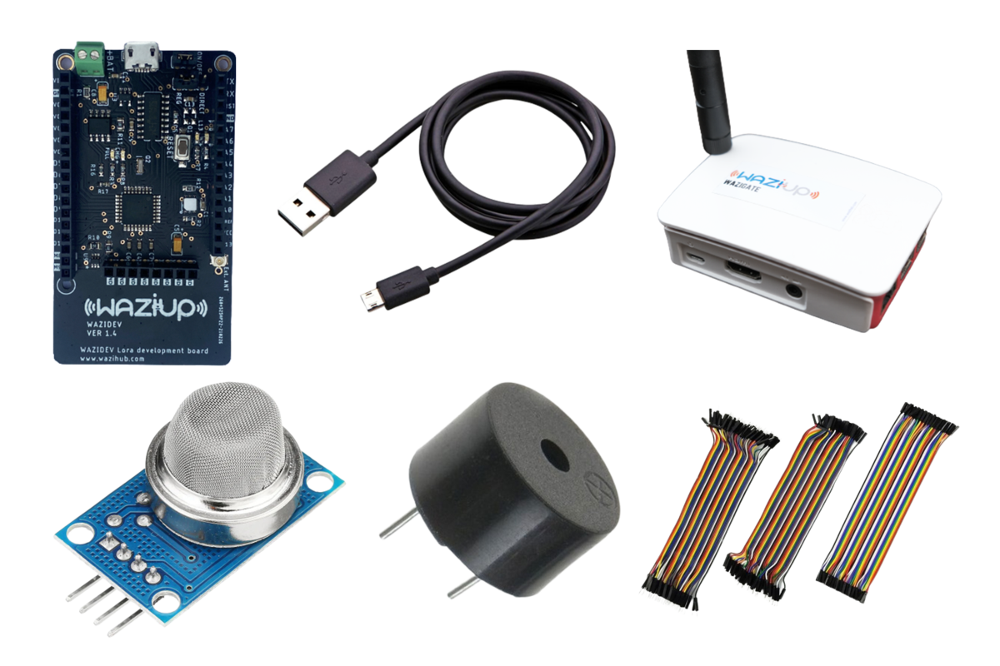

# Overview

When a fire breaks out, time is of the essence. Prompt measures need to be taken to evacuate the trapped people and contain the fire before it spreads out of hand. However, to accomplish this we need a system that can detect fires before it is too late.

This fully automated fire detection and alarm system is equipped with a temperature, humidity and smoke sensor.

Here's what we will be learning:
- What parts are needed
- How to wire up and read sensor values
- How to trigger an effector(buzzer)
- How to communicate to the cloud over LoRa

# What parts do we need?

To follow this user manual, one will need the following hardware:

Hardware
  - WaziDev
  - Micro USB Cable
  - Wazigate
  - MQ5 Gas and Smoke Sensor
  - Some Jumper Wires

Software
  - Install the [Arduino IDE](https://www.arduino.cc/en/Main/Software) for the programming aspects.
  - Install the [WaziDev](https://github.com/Waziup/WaziDev/archive/master.zip) libraries for LoRa communication. Follow the guide [here](https://waziup.io/documentation/wazidev/user-manual/#install-the-wazidev-sketchbook)
  - Install the [Si7021](https://github.com/adafruit/Adafruit_Si7021) digital humidity and temperature sensor 