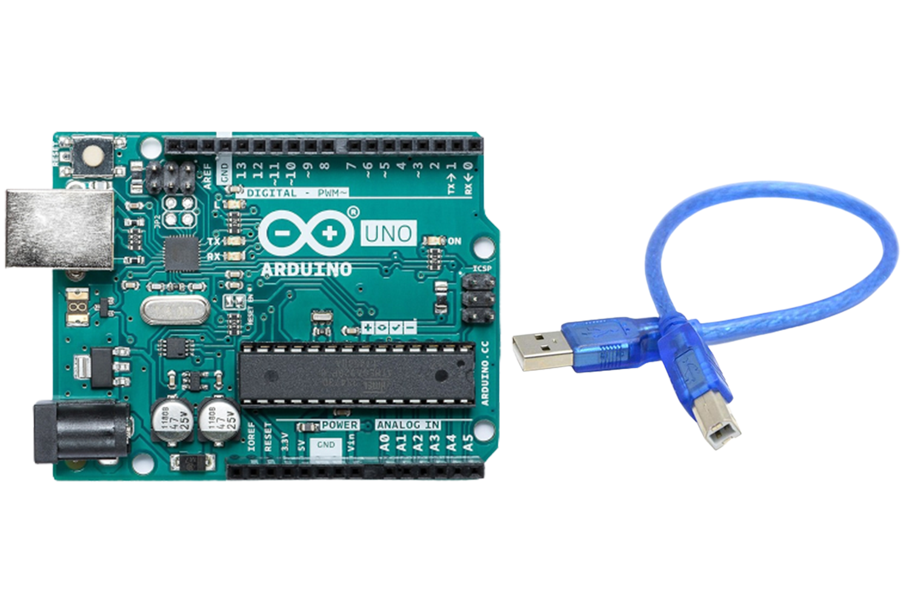
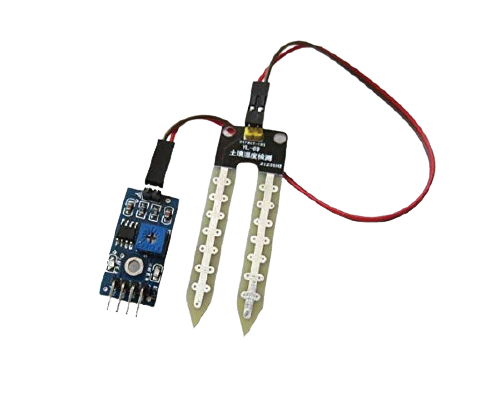
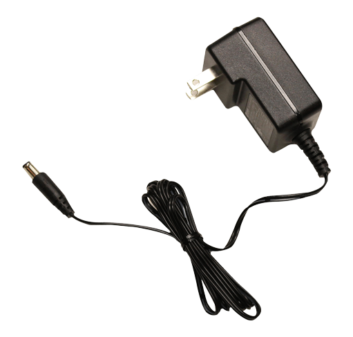

Overview
========

As you may already know, plants require water, light(usually sunlight), nutrients etc,...to grow healthy. While these factors can be easily provided, the problem is usually forgetfulness.

Luckily for us, we can use smart electronic devices to automate some of the above mentioned entities required for plant growth, specifically watering.

Here's what we will be learning:
- What parts are needed
- How to wire up and read sensor values
- How to wire up and trigger an actuator
- How to use the actuator to control a water pump

What parts do we need?
=====================

To follow this user manual, one will need the following hardware:

Hardware
  - an Arduino Uno with USB Cable
  - Soil Moisture Sensor
  - 5v Single Channel Relay
  - Submersible Water Pump
  - Some Jumper Wires
  - Power Supply







Software
  - In terms of software, you need to intall the [Arduino IDE](https://www.arduino.cc/en/Main/Software) for the programming aspects.

**Step \#1:** Setting up the Moisture Sensor
==============================
Soil moisture sensors measures the amount of water in the soil to maintain consistent and ideal soil conditions for plants.
They can be used to detect the moisture of soil or judge if there is water around the sensor. They can be very easy to use, 
just insert it into the soil and then read it.

Schematics
----------
There are only three pins that you need to worry about on most of these analog soil humidity sensors. The common principle is to power the sensor and get the output voltage on an analog pin. In our case, we are going to use pin A0.


Code Sample
-----------
```c
/********************
 * Soil Moisture Tester
 * Read soil humidity by measuring its resistance.
 ********************/

int sensorPin = A0;
int soilHumidity = -1;

void setup() {
  Serial.begin(38400);

}

void loop() {
  soilHumidity = analogRead(sensorPin);
  Serial.println(soilHumidity);
  delay(100);
}
```