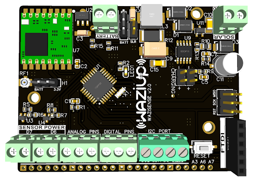
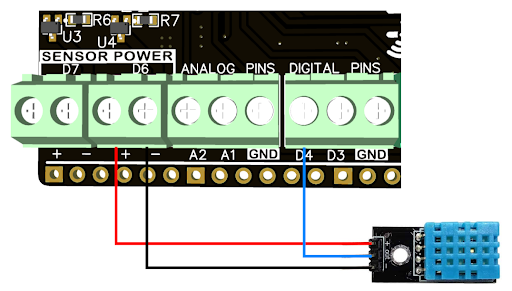
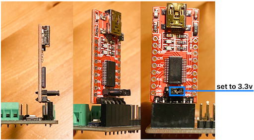
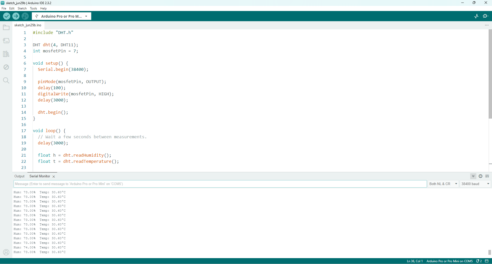

Step #1: Setup Programming Environment
==============================
The very first step is to setup the environment for sensing the temperature and humidity. This section will guide through the installation of Arduino IDE and its configuration for the WaziDev.

Install Arduino IDE
----------
<alert severity='info'>**Step \#1.1:** Download Arduino IDE from here: [https://www.arduino.cc/en/Main/Software](https://www.arduino.cc/en/Main/Software)</alert>

  - If you use Windows there is a guide here: [https://docs.arduino.cc/software/ide-v1/tutorials/Windows](https://docs.arduino.cc/software/ide-v1/tutorials/Windows).
  - If you use Linux there is a guide here: [https://www.arduino.cc/en/Guide/Linux](https://www.arduino.cc/en/Guide/Linux).
  - If you use Mac there is a guide here: [https://www.arduino.cc/en/Guide/MacOSX](https://www.arduino.cc/en/Guide/MacOSX).


Locate the WaziDev sketchbook
-----------

<alert severity='info'> **Step \#1.2:** Download the [WaziDev sketchbook](https://github.com/Waziup/WaziDev/archive/master.zip). Unzip the file to the location of your choice.</alert>

<alert severity='info'>**Step \#1.3:** In the Arduino IDE Preferences, change the "sketchbook location" to the WaziDev sketchbook folder.</alert>


First, open "Preferences" in the Arduino IDE menu File -\> Preferences.


Configure the Arduino IDE
-----------

<alert severity='info'>**Step \#1.4:** Connect your WaziDev board to your PC via USB cable.</alert>


If you see some lights turning on, that means your USB connection is working.

<alert severity='info'>**Step \#1.5:** Open your Arduino IDE.</alert>

On Linux, you need to open it as an **administrator** (i.e. type "sudo arduino"). You should see something like this:


<alert severity='info'>**Step \#1.6:** Select the right port.</alert>

Go to **Tools** > **Port**. The **port** depends on your Operating System. You should select a port similar to these:

-   **Linux:** /dev/ttyUSB0
-   **MacOS:** /dev/cu.usbserialXXXXX
-   **Windows:** COM3 or higher.


<alert severity='info'>**Step \#1.7:** Select the Development Board.</alert>

Select the board "Arduino Pro or Pro Mini" in the **Tools** > **Board** menu.


<alert severity='info'>**Step \#1.8:** Select the Processor.</alert>

Select the processor "ATmega328P (3.3V, 8 MHz)" in the **Tools** > **Processor** menu.


Step #2: Setup Hardware Connection and Sensing (Using WaziDev)
============================================
Now that the environment is setup, it's time to connect the temperature sensor **DHT11** to the the wazidev. Bellow is the chematic of the connection between wazidev and dht11.


With the DHT11, the simplest wiring possible is: no wires!
DHT11 have a GND (ground) pin, a data pin, and a VCC pin.
Just plug the DHT11 directly into the WaziDev.
Be careful to align the pins:

-   DHT11 GND -\> WaziDev GND
-   DHT11 data -\> WaziDev D2
-   DHT11 VCC -\> WaziDev D3


<alert type="warning">in some cases based on the dht11 manufacturer the in build pins could be shuffled, in this case please check the pins of the sensor.</alert>


<alert severity='info'>**Step \#2.1:** Write the following in the code editor.</alert>

Code
----
```c
#include <DHT.h>

//Constants
#define DHTPIN 2
#define DHTTYPE DHT11   // DHT 11
DHT dht(DHTPIN, DHTTYPE); // Initialize DHT sensor for normal Arduino

void setup() { // to run once
  Serial.begin(38400); // Initialize the serial port
  Serial.println("DHT11 Humidity - Temperature Sensor");
  Serial.println("RH\t Temp (C)");

//  pinMode(5, OUTPUT);  digitalWrite(5, LOW);
  pinMode(3, OUTPUT);  digitalWrite(3, HIGH);
  
  dht.begin();
  delay(2000);
}

void loop() {
  delay(3000);
  
  // Reading temperature or humidity takes about 250 milliseconds!
  // Sensor readings may also be up to 2 seconds 'old' (its a very slow sensor)
  float h = dht.readHumidity();
  float t = dht.readTemperature();
  // Check if any reads failed and exit early (to try again).
  if (isnan(h) || isnan(t)) {
    Serial.println("Failed to read from DHT11 sensor!");
    return;
  }

  Serial.print(h); 
  Serial.print(" %\t\t");
  Serial.print(t); 
  Serial.println(" °C");
  // Wait a few seconds between measurements. The DHT11 should not be read at a higher frequency of
  // about once every 2 seconds. So we add a 3 second delay to cover this.
  
}
```


<alert severity='info'>**Step \#2.2:** Install the DHT library using Library Manager.</alert>

 Go to **Sketch** -\> **Include Library** -\> **Libraries Manager**.

 Alternatively you can press Cntrl + Shift + i (for Windows users)

 

 In the libraries manager, make sure the "**Type**" and "**Topic**" fields are set to "**ALL**".

 Next, search for **DHT** and install the DHT sensor library by **Adafruit** as shown in the image below.

 

 Close the library manager after the installation completes

 **NOTE:** Repeat step **3** for all other sensors you use. i.e search and install the required sensor libraries using the library manager.


<alert severity='info'>**Step \#4:** Compile and upload the code.</alert>

You just need to hit the arrow button.

<alert severity='info'>**Step \#5:** Open the Arduino IDE Serial Monitor.</alert>

In the Tools menu open the serial monitor and then set the data rate to 38400 baud.


You should see both temperature and humidity displayed.


Step #3: Setup Hardware Connection and Sensing (Using WaziSense)
============================================

Now let's try to connect the temperature sensor **DHT11** to the the waziSense.




Bellow is the chematic of the connection between waziSense and dht11:


With the DHT11, the simplest wiring possible is: no wires!
DHT11 have a GND (ground) pin, a data pin, and a VCC pin.

Be careful to align the pins:

-   DHT11 GND -\> WaziSense Sensor Power port D6 (-)
-   DHT11 data -\> WaziSense D4
-   DHT11 VCC -\> WaziSense Sensor Power port D6 (+)


<alert type="warning">in some cases based on the dht11 manufacturer the in build pins could be shuffled, in this case please check the pins of the sensor.</alert>



The FTDI port is used to program the ATmega328p microcontroller. It is advised to use an FT232RL FTDI programmer because its pins are already aligned with the WaziSense v2 FTDI port.

<alert type="warning"> Make sure to set the FTDI modules’ voltage output to 3.3v, using the provided jumper on the FTDI board. The ATmega328p on the WaziSense v2 is NOT 5v tolerant. </alert>


<alert severity='info'>**Step \#2.1:** Write the following in the code editor.</alert>

Code
----
```c
#include "DHT.h"

DHT dht(4, DHT11);
int mosfetPin = 6;

void setup() {
  Serial.begin(38400);

  pinMode(mosfetPin, OUTPUT);
  delay(100);
  digitalWrite(mosfetPin, HIGH);
  delay(3000);

  dht.begin();
}

void loop() {
  // Wait a few seconds between measurements.
  delay(3000);

  float h = dht.readHumidity();
  float t = dht.readTemperature();
  
  // Check if any reads failed and exit early (to try again).
  if (isnan(h) || isnan(t)) {
    Serial.println(F("Failed to read from DHT sensor!"));
    return;
  }

  Serial.print("Hum: ");
  Serial.print(h);
  Serial.print("%  Temp: ");
  Serial.print(t);
  Serial.println("°C ");
}


```


<alert severity='info'>**Step \#2.2:** Install the DHT library using Library Manager.</alert>

 Go to **Sketch** -\> **Include Library** -\> **Libraries Manager**.

 Alternatively you can press Cntrl + Shift + i (for Windows users)

 

 In the libraries manager, make sure the "**Type**" and "**Topic**" fields are set to "**ALL**".

 Next, search for **DHT** and install the DHT sensor library by **Adafruit** as shown in the image below.

 

 Close the library manager after the installation completes

 **NOTE:** Repeat step **3** for all other sensors you use. i.e search and install the required sensor libraries using the library manager.


<alert severity='info'>**Step \#4:** Compile and upload the code.</alert>

You just need to hit the arrow button.

<alert severity='info'>**Step \#5:** Open the Arduino IDE Serial Monitor.</alert>

In the Tools menu open the serial monitor and then set the data rate to 38400 baud.



You should see both temperature and humidity displayed.

