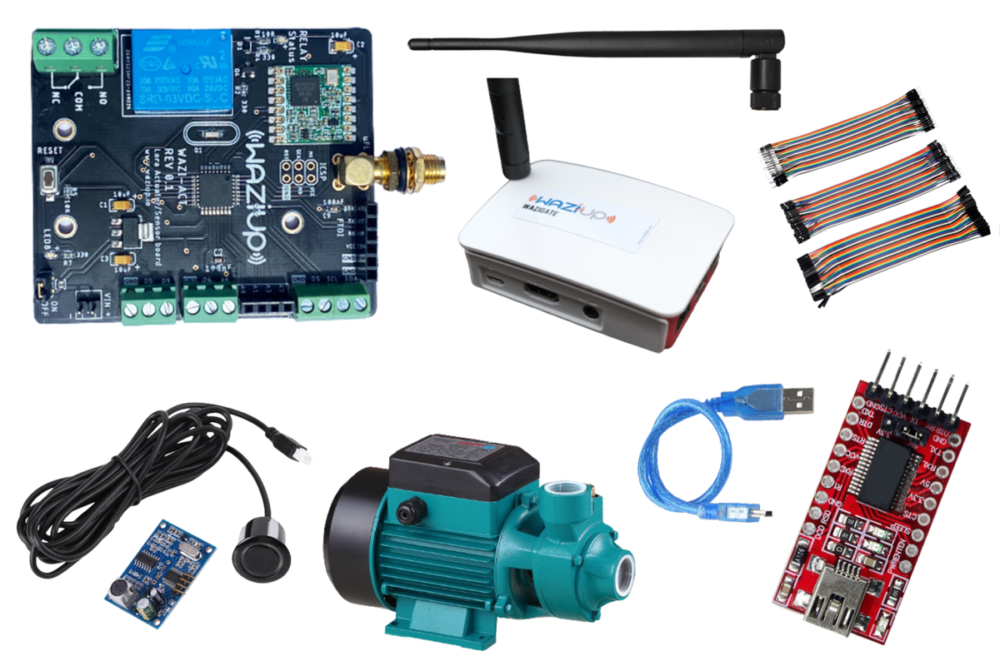

Overview
----

It is not rare to find dissolved solids in the water. The materials that constitute dissolved solids in water include materials such as minerals, salts, anionic and cationic substances. They can also include pollutants such as heavy metals, and other substances such as organic materials that may have leaked into the water supply system and reduce the purity of water which isn't visible to the open eyes.

With the help of our advanced technology we can now monitor the quality of water.

In this guide, we will look at how to monitor water quality through interfacing Gravity Analog TDS Sensor with WaziDev and read the value in 16×2 LCD Display. Since TDS Value depends upon the temperature. So we will also add DS18B20 Waterproof Temperature Sensor to measure Water Temperature. 

Here's what we will be learning:
- What parts are needed
- How to wire up and read sensor values
- How to communicate to the cloud over LoRa

What parts do we need?
----

To follow this user manual, one will need the following:

Hardware
  - WaziDev
  - Mini USB Cable
  - DS18B20 Temperature Sensor
  - TDS Sensor
  - Resistor 4.7k
  - Potentiometer 10k
  - 15*2 LCD display
  - Some Jumper Wires
  - wazigate
  - Lora 868Mhz Antenna

Software
  - Install the [Arduino IDE](https://www.arduino.cc/en/Main/Software) for the programming aspects.
  - Install the [WaziDev](https://github.com/Waziup/WaziDev/archive/master.zip) libraries for LoRa communication. Follow the guide [here](https://waziup.io/documentation/wazidev/user-manual/#install-the-wazidev-sketchbook)
