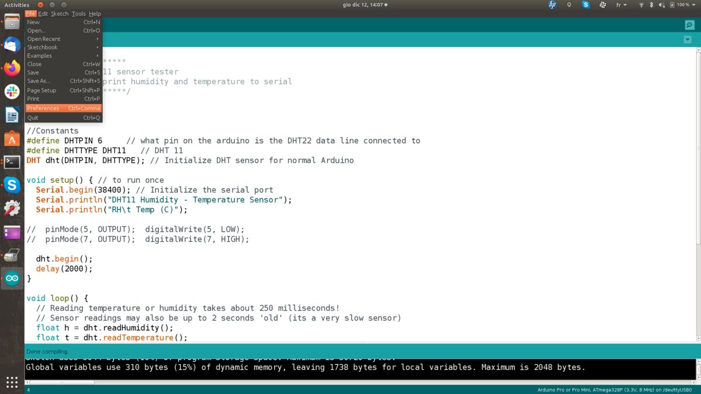
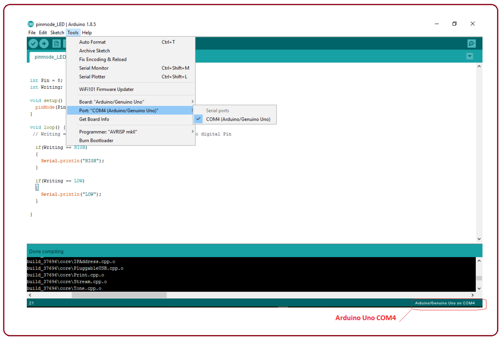
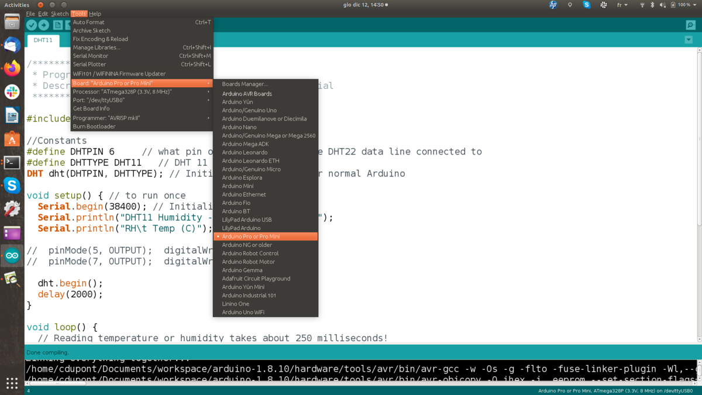
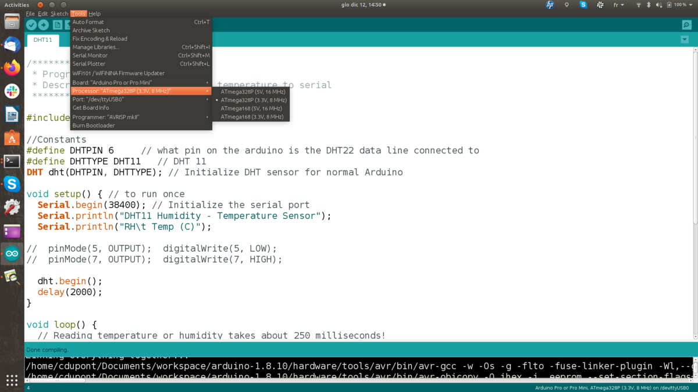
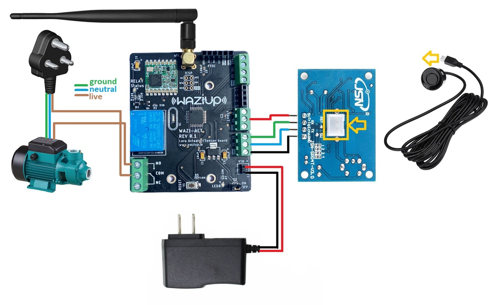
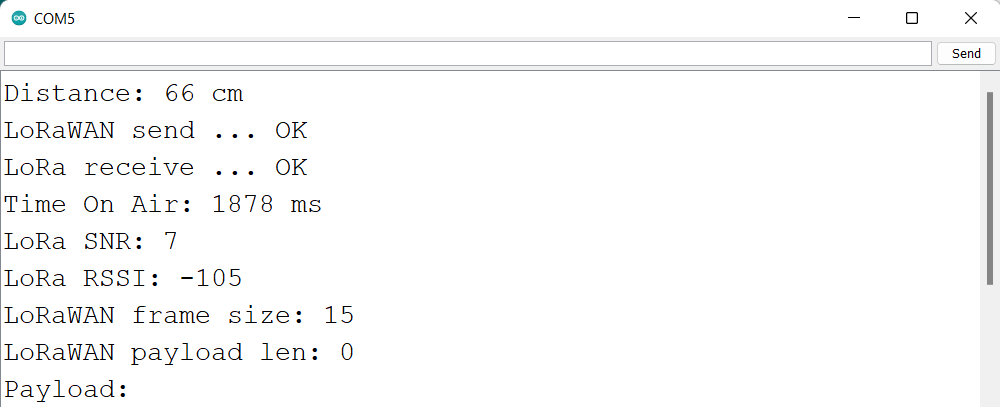
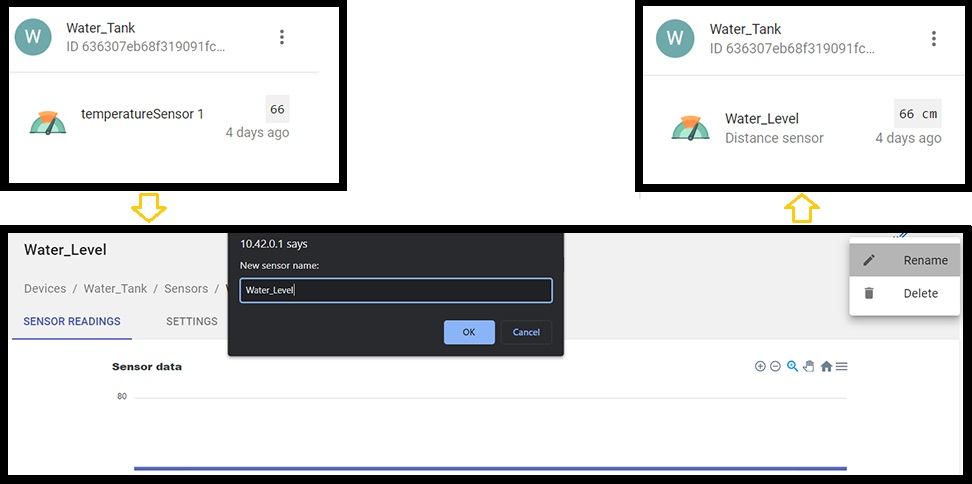
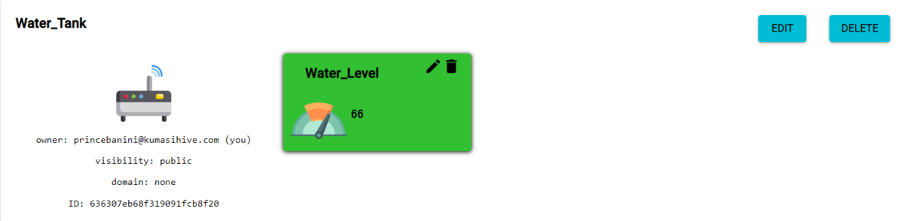
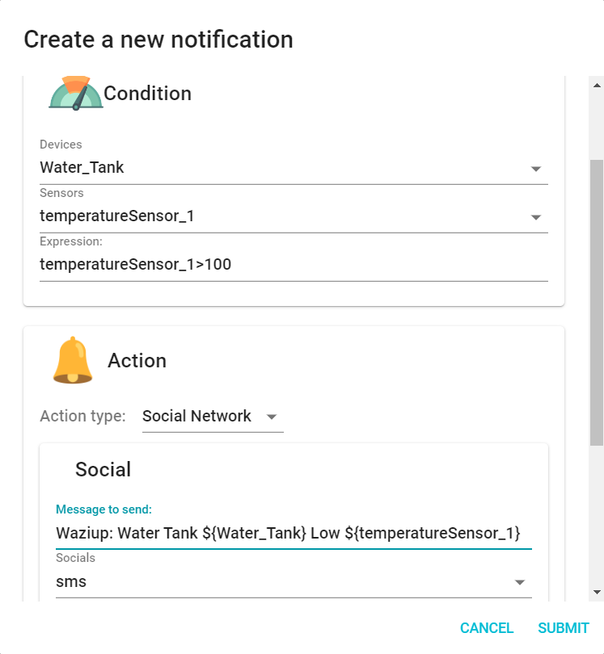

Step #1: Setup Programming Environment
==============================
The very first step is to setup the environment for sensing the temperature and humidity. This section will guide through the installation of Arduino IDE and its configuration for the WaziDev.

Install Arduino IDE
----------
<alert severity='info'>**Step \#1.1:** Download Arduino IDE from here: [https://www.arduino.cc/en/Main/Software](https://www.arduino.cc/en/Main/Software)</alert>

  - If you use Windows there is a guide here: [https://docs.arduino.cc/software/ide-v1/tutorials/Windows](https://docs.arduino.cc/software/ide-v1/tutorials/Windows).
  - If you use Linux there is a guide here: [https://www.arduino.cc/en/Guide/Linux](https://www.arduino.cc/en/Guide/Linux).
  - If you use Mac there is a guide here: [https://www.arduino.cc/en/Guide/MacOSX](https://www.arduino.cc/en/Guide/MacOSX).


Locate the WaziDev sketchbook
-----------

<alert severity='info'> **Step \#1.2:** Download the [WaziDev sketchbook](https://github.com/Waziup/WaziDev/archive/master.zip). Unzip the file to the location of your choice.</alert>

<alert severity='info'>**Step \#1.3:** In the Arduino IDE Preferences, change the "sketchbook location" to the WaziDev sketchbook folder.</alert>




First, open "Preferences" in the Arduino IDE menu File -\> Preferences.


Configure the Arduino IDE
-----------

<alert severity='info'>**Step \#1.4:** Connect your WaziDev board to your PC via USB cable.</alert>


If you see some lights turning on, that means your USB connection is working.

<alert severity='info'>**Step \#1.5:** Open your Arduino IDE.</alert>

On Linux, you need to open it as an **administrator** (i.e. type "sudo arduino"). You should see something like this:


<alert severity='info'>**Step \#1.6:** Select the right port.</alert>

Go to **Tools** > **Port**. The **port** depends on your Operating System. You should select a port similar to these:

-   **Linux:** /dev/ttyUSB0
-   **MacOS:** /dev/cu.usbserialXXXXX
-   **Windows:** COM3 or higher.



<alert severity='info'>**Step \#1.7:** Select the Development Board.</alert>

Select the board "Arduino Pro or Pro Mini" in the **Tools** > **Board** menu.



<alert severity='info'>**Step \#1.8:** Select the Processor.</alert>

Select the processor "ATmega328P (3.3V, 8 MHz)" in the **Tools** > **Processor** menu.




Step #2: Interfacing One wire temperature sensor with WaziDev
============================
### Connection interface

### Architecture


### Code Sample

```c
#include <OneWire.h>
#include <DallasTemperature.h>

// Data wire is connect to the wazidev digital pin D4
#define ONE_WIRE_BUS 4

// Setup a oneWire instance to communicate with any OneWire devices
OneWire oneWire(ONE_WIRE_BUS);

// Pass our oneWire reference to Dallas Temperature sensor 
DallasTemperature sensors(&oneWire);

void setup(void)
{
  // Start serial communication for debugging purposes
  Serial.begin(38400);
  // Start up the library
  sensors.begin();
}

void loop(void){ 
  // Call sensors.requestTemperatures() to issue a global temperature and Requests to all devices on the bus
  sensors.requestTemperatures(); 
  
  Serial.print("Celsius temperature: ");
  // Why "byIndex"? You can have more than one IC on the same bus. 0 refers to the first IC on the wire
  Serial.print(sensors.getTempCByIndex(0)); 
  Serial.print(" - Fahrenheit temperature: ");
  Serial.println(sensors.getTempFByIndex(0));
  //delay for 10 seconds
  delay(10000);
}
 ```

Step #3: Interfacing gravity analog TDS sensor with WaziDev
============================

Step #4: Interfacing Gravity Analog TDS Sensor & One wire temperature Sensor with WaziDev & LCD Display
================================================


Step #5: Combining Sensing and Lora Communication
=============================================================

At this point, we want the WaziDev to constantly update Wazicloud with the current state of the tank through Wazigate.

**NOTE:** Make sure to have a configured gateway up and running before uploading this next code. Kindly see the lectures under **Module 5 Lecture 2** for how to setup a Waziup Gateway.

In order to make our project mobile, we can add a battery to power the sensor and the Wazidev as shown below.

Schematics
----------


Code Sample
-----------

```c
#include <WaziDev.h>
#include <xlpp.h>
#include <Base64.h>

//sensor pins
#define trigPin  9
#define echoPin  5

//sensor power pin
#define powerPin  4

//relay pin
const int relayPin = 7;

// NwkSKey (Network Session Key) and Appkey (AppKey) are used for securing LoRaWAN transmissions.
// You need to copy them from/to your LoRaWAN server or gateway.
// You need to configure also the devAddr. DevAddr need to be different for each devices!!
// Copy'n'paste the DevAddr (Device Address): 26011D00
unsigned char devAddr[4] = {0x26, 0x01, 0x1D, 0x00};

// Copy'n'paste the key to your Wazigate: 23158D3BBC31E6AF670D195B5AED5525
unsigned char appSkey[16] = {0x23, 0x15, 0x8D, 0x3B, 0xBC, 0x31, 0xE6, 0xAF, 0x67, 0x0D, 0x19, 0x5B, 0x5A, 0xED, 0x55, 0x25};

// Copy'n'paste the key to your Wazigate: 23158D3BBC31E6AF670D195B5AED5525
unsigned char nwkSkey[16] = {0x23, 0x15, 0x8D, 0x3B, 0xBC, 0x31, 0xE6, 0xAF, 0x67, 0x0D, 0x19, 0x5B, 0x5A, 0xED, 0x55, 0x25};

WaziDev wazidev;

void setup()
{
  Serial.begin(38400);
  wazidev.setupLoRaWAN(devAddr, appSkey, nwkSkey);

  //turning sensor on
  pinMode(powerPin, OUTPUT);
  delay(500);
  digitalWrite(powerPin, HIGH);

  //declaring relay pin mode
  pinMode(relayPin, OUTPUT);
  delay(500);
  //make sure the relay isnt on during a restart
  digitalWrite(relayPin, LOW);

  //declaring sensor pin modes
  pinMode(trigPin, OUTPUT);

  //inputpull up to prevent noise on echo pin
  pinMode(echoPin, INPUT_PULLUP);

}

XLPP xlpp(120);

void loop(void)
{
  //reading sensor values
  unsigned long duration = 0;
  int distance = 0;
  int average = 0;

  //taking 100 distance samples
  while (average <= 100) {
    digitalWrite(trigPin, LOW);
    delayMicroseconds(5);
    digitalWrite(trigPin, HIGH);
    delayMicroseconds(10);
    digitalWrite(trigPin, LOW);

    duration = pulseIn(echoPin, HIGH, 1000);
    distance += duration * 0.034 / 2;
    average += 1;
    delay(30);
  }

  //finding the average of 100 samples
  distance = distance / average;

  //checking to be sure the current distance value is a number and greater than 0
  if (!(isnan(distance) || distance < 0)) {
    return;
  }

  Serial.print("Distance: ");
  Serial.print(distance);
  Serial.println(" cm");

  //full tank value of 30cm and low value of 100cm
  if (distance < 30) { //tank full
    digitalWrite(relayPin, LOW);
  } else if (distance > 100) { //tank running low
    digitalWrite(relayPin, HIGH);
  }

  delay(10);
  // 1
  // Create xlpp payload.

  xlpp.reset();

  xlpp.addTemperature(1, distance);

  // 2.
  // Send paload with LoRaWAN.
  serialPrintf("LoRaWAN send ... ");
  uint8_t e = wazidev.sendLoRaWAN(xlpp.buf, xlpp.len);
  if (e != 0)
  {
    serialPrintf("Err %d\n", e);
    delay(60000);
    return;
  }
  serialPrintf("OK\n");

  // 3.
  // Receive LoRaWAN message (waiting for 6 seconds only).
  serialPrintf("LoRa receive ... ");
  uint8_t offs = 0;
  long startSend = millis();
  e = wazidev.receiveLoRaWAN(xlpp.buf, &xlpp.offset, &xlpp.len, 6000);
  long endSend = millis();
  if (e != 0)
  {
    if (e == ERR_LORA_TIMEOUT) {
      serialPrintf("nothing received\n");
    }
    else
    {
      serialPrintf("Err %d\n", e);
    }
    delay(60000);
    return;
  }
  serialPrintf("OK\n");

  serialPrintf("Time On Air: %d ms\n", endSend - startSend);
  serialPrintf("LoRa SNR: %d\n", wazidev.loRaSNR);
  serialPrintf("LoRa RSSI: %d\n", wazidev.loRaRSSI);
  serialPrintf("LoRaWAN frame size: %d\n", xlpp.offset + xlpp.len);
  serialPrintf("LoRaWAN payload len: %d\n", xlpp.len);
  serialPrintf("Payload: ");
  char payload[100];
  base64_decode(payload, xlpp.getBuffer(), xlpp.len);
  serialPrintf(payload);
  serialPrintf("\n");

  delay(5000);
}
```

At this point, all we need to do is flash the above code to the WaziACT and attach the ultrasonic head to the upper part of the desired tank for sensing.

If we take a look at the data in our serial monitor we should see something similar to the image below.



Since we used `xlpp.addTemperature(1, distance);` for the distance or water level values, we have to rename the sensor on the wazigate for clarity as shown below.



If we take a look at the Wazicloud platform, we will also see the sensor value once again.



we can also setup notifications on WaziCloud, for when the water level threshold conditions are met. Kindly see the lectures under **Module 5 Lecture 3** for how to setup a Notifications on Wazicloud.


