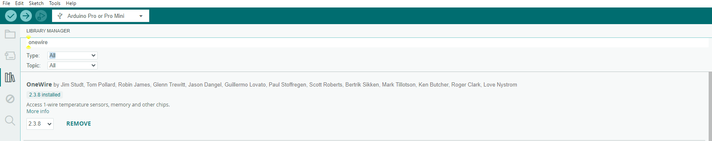

Step #1: Setup Programming Environment
==============================
The very first step is to setup the environment for sensing the temperature and humidity. This section will guide through the installation of Arduino IDE and its configuration for the WaziDev.

Install Arduino IDE
----------
<alert severity='info'>**Step \#1.1:** Download Arduino IDE from here: [https://www.arduino.cc/en/Main/Software](https://www.arduino.cc/en/Main/Software)</alert>

  - If you use Windows there is a guide here: [https://docs.arduino.cc/software/ide-v1/tutorials/Windows](https://docs.arduino.cc/software/ide-v1/tutorials/Windows).
  - If you use Linux there is a guide here: [https://www.arduino.cc/en/Guide/Linux](https://www.arduino.cc/en/Guide/Linux).
  - If you use Mac there is a guide here: [https://www.arduino.cc/en/Guide/MacOSX](https://www.arduino.cc/en/Guide/MacOSX).


Locate the WaziDev sketchbook
-----------

<alert severity='info'> **Step \#1.2:** Download the [WaziDev sketchbook](https://github.com/Waziup/WaziDev/archive/master.zip). Unzip the file to the location of your choice.</alert>

<alert severity='info'>**Step \#1.3:** In the Arduino IDE Preferences, change the "sketchbook location" to the WaziDev sketchbook folder.</alert>


First, open "Preferences" in the Arduino IDE menu File -\> Preferences.


Configure the Arduino IDE
-----------

<alert severity='info'>**Step \#1.4:** Connect your WaziDev board to your PC via USB cable.</alert>


If you see some lights turning on, that means your USB connection is working.

<alert severity='info'>**Step \#1.5:** Open your Arduino IDE.</alert>

On Linux, you need to open it as an **administrator** (i.e. type "sudo arduino"). You should see something like this:


<alert severity='info'>**Step \#1.6:** Select the right port.</alert>

Go to **Tools** > **Port**. The **port** depends on your Operating System. You should select a port similar to these:

-   **Linux:** /dev/ttyUSB0
-   **MacOS:** /dev/cu.usbserialXXXXX
-   **Windows:** COM3 or higher.


<alert severity='info'>**Step \#1.7:** Select the Development Board.</alert>

Select the board "Arduino Pro or Pro Mini" in the **Tools** > **Board** menu.


<alert severity='info'>**Step \#1.8:** Select the Processor.</alert>

Select the processor "ATmega328P (3.3V, 8 MHz)" in the **Tools** > **Processor** menu.


Step #2: Interfacing DS18B20 sensor with WaziDev
============================
Now that the environment is setup, it's time to connect the temperature sensor DS18B20 to the the wazidev. 

Bellow is the schematic of the connection between wazidev and DS18B20.


The DS18B20 has 3 colors of wire- black, red and yellow. The black wire and red wire repesents the GND pin and VCC pin respectively and the yellow pin is the Output pin.

- DS18B20 GND  -> WaziDev GND
- DS18B20 VCC  -> WaziDev VCC
- DS18B20 Output -> Wazidev D4
- Pull the Output pin via 4.7K resistor to VCC 


### Code

```c
#include <OneWire.h>
#include <DallasTemperature.h>

// Data wire is connect to the wazidev digital pin D4
#define ONE_WIRE_BUS 4

// Setup a oneWire instance to communicate with any OneWire devices
OneWire oneWire(ONE_WIRE_BUS);

// Pass our oneWire reference to Dallas Temperature sensor 
DallasTemperature sensors(&oneWire);

void setup(void)
{
  // Start serial communication for debugging purposes
  Serial.begin(38400);
  // Start up the library
  sensors.begin();
}

void loop(void){ 
  // Call sensors.requestTemperatures() to issue a global temperature and Requests to all devices on the bus
  sensors.requestTemperatures(); 
  
  Serial.print("Celsius temperature: ");
  // Why "byIndex"? You can have more than one IC on the same bus. 0 refers to the first IC on the wire
  Serial.print(sensors.getTempCByIndex(0)); 
  Serial.print(" - Fahrenheit temperature: ");
  Serial.println(sensors.getTempFByIndex(0));
  //delay for 10 seconds
  delay(10000);
}
 ```
 Install the following two libraries using Library Manager.

 `Go to Sketch -> Include Library -> Manage Library`




The final step is to compile and upload the code. You will see the result in your serial monitor.


Step #3: Interfacing gravity analog TDS sensor and Temperature sensor with WaziDev
============================

The next step is to connect the TDS sensor with the setup.

Bellow is the schematic of the connection between wazidev, DS18B20 and TDS sensor.


The connection of TDS Sensor is fairly simple. It has 3 wires of VCC, GND and Analog pin. 

- TDS VCC -> Wazidev VCC
- TDS GND -> Wazidev GND
- TDS Analog pin -> Wazidev Analog pin A2

### Code

```c
#include <EEPROM.h>
#include "GravityTDS.h"

#include <OneWire.h>
#include <DallasTemperature.h>

 
#define ONE_WIRE_BUS 4
#define TdsSensorPin A2
 
OneWire oneWire(ONE_WIRE_BUS);
GravityTDS gravityTds;
 
DallasTemperature sensors(&oneWire);
 
float tdsValue = 0;
 
void setup()
{
    Serial.begin(115200);
    
    sensors.begin();
    gravityTds.setPin(TdsSensorPin);
    gravityTds.setAref(5.0);  //reference voltage on ADC, default 5.0V on Arduino UNO
    gravityTds.setAdcRange(1024);  //1024 for 10bit ADC;4096 for 12bit ADC
    gravityTds.begin();  //initialization
}
 
void loop()
{
    sensors.requestTemperatures();
 
    gravityTds.setTemperature(sensors.getTempCByIndex(0));  // set the temperature and execute temperature compensation
    gravityTds.update();  //sample and calculate
    tdsValue = gravityTds.getTdsValue();  // then get the value
    
    Serial.print("TDS Value is: ");
    Serial.print(tdsValue,0);
    Serial.println(" ppm");
    
    Serial.print("Temperature is: ");
    Serial.print(sensors.getTempCByIndex(0));
    Serial.println(" degree celcius");
    

    
    delay(1500);

}
```

Download the zip [file](https://github.com/DFRobot/GravityTDS).

 `Go to Sketch -> Include Library -> Add .ZIP Library`

 The final step is to compile and upload the code. You will see the result in your serial monitor.

Step #4: Interfacing Gravity Analog TDS Sensor & One wire temperature Sensor with WaziDev & OLED Display
================================================

I this step we will integrate and OLED with our prototype, so that we don't have to monitor our data from the serial monitor and if we want to make our prototype mobile then all we need to do is connectine a battery to the board. The connection of the battery is illustrated in the next section.

Bellow is the schematic of the connection between wazidev, DS18B20, TDS sensor and OLED.


### Code

```c

#include <Wire.h>
#include <Adafruit_GFX.h>
#include <Adafruit_SSD1306.h>

#include <EEPROM.h>
#include "GravityTDS.h"

#include <OneWire.h>
#include <DallasTemperature.h>

 
#define ONE_WIRE_BUS 4
#define TdsSensorPin A2
#define SCREEN_WIDTH 128 // OLED display width, in pixels
#define SCREEN_HEIGHT 64 // OLED display height, in pixels

// Declaration for an SSD1306 display connected to I2C (SDA, SCL pins)
Adafruit_SSD1306 display(SCREEN_WIDTH, SCREEN_HEIGHT, &Wire, -1);
 
OneWire oneWire(ONE_WIRE_BUS);
GravityTDS gravityTds;
 
DallasTemperature sensors(&oneWire);
 
float tdsValue = 0;
 
void setup()
{
    Serial.begin(115200);
    
    sensors.begin();
    gravityTds.setPin(TdsSensorPin);
    gravityTds.setAref(5.0);  //reference voltage on ADC, default 5.0V on Arduino UNO
    gravityTds.setAdcRange(1024);  //1024 for 10bit ADC;4096 for 12bit ADC
    gravityTds.begin();  //initialization

    if(!display.begin(SSD1306_SWITCHCAPVCC, 0x3C)) { // Address 0x3D for 128x64
      Serial.println(F("SSD1306 allocation failed"));
      for(;;);
    }  


}
 
void loop()
{
    sensors.requestTemperatures();
 
    gravityTds.setTemperature(sensors.getTempCByIndex(0));  // set the temperature and execute temperature compensation
    gravityTds.update();  //sample and calculate
    tdsValue = gravityTds.getTdsValue();  // then get the value

    Serial.print("TDS Value is: ");
    Serial.print(tdsValue,0);
    Serial.println(" ppm");
    
    Serial.print("Temperature is: ");
    Serial.print(sensors.getTempCByIndex(0));
    Serial.println(" degree celcius");
    
  delay(2000);
  display.clearDisplay();

  display.setTextSize(1);
  display.setTextColor(WHITE);
  display.setCursor(0, 10);
  // Display static text
  display.print("TDS Value is: ");
  display.print(tdsValue,0);
  display.println(" ppm");
    
  display.print("Temperature is: ");
  display.print(sensors.getTempCByIndex(0));
  display.println(" degree celcius");

  display.display(); 
    
  delay(2000);

}
```
Install the following two libraries

 `Go to Sketch -> Include Library -> Manage Library`


The final step is to compile and upload the code. you will be able to see the result both in the serial monitor and in the OLED.

Step #5: Combining Sensing and Lora Communication
=============================================================

At this point, we want the WaziDev to constantly update Wazicloud with the current state of the tank through Wazigate.

**NOTE:** Make sure to have a configured gateway up and running before uploading this next code. Kindly see the lectures under **Module 5 Lecture 2** for how to setup a Waziup Gateway.

In order to make our project mobile, we can add a battery to power the sensor and the Wazidev as shown below.

Schematics
----------


Code Sample
-----------

```c

#include <WaziDev.h>
#include <xlpp.h>
#include <EEPROM.h>
#include "GravityTDS.h"
#include <OneWire.h>
#include <DallasTemperature.h>
#define ONE_WIRE_BUS 4
#define TdsSensorPin A2

// LoRaWANKey is used as both NwkSKey (Network Session Key) and Appkey (AppKey) for secure LoRaWAN transmission.
// Copy'n'paste the key to your Wazigate: 23158D3BBC31E6AF670D195B5AED5525
unsigned char loRaWANKey[16] = {0x23, 0x15, 0x8D, 0x3B, 0xBC, 0x31, 0xE6, 0xAF, 0x67, 0x0D, 0x19, 0x5B, 0x5A, 0xED, 0x55, 0x25};
// Copy'n'paste the DevAddr (Device Address): 26011D87
unsigned char devAddr[4] = {0x26, 0x01, 0x1D, 0x01};
// You can change the Key and DevAddr as you want.


 
OneWire oneWire(ONE_WIRE_BUS);
GravityTDS gravityTds;
 
DallasTemperature sensors(&oneWire);
 
float tdsValue = 0;

WaziDev wazidev;

void setup()
{
  Serial.begin(115200);

  sensors.begin();
  gravityTds.setPin(TdsSensorPin);
  gravityTds.setAref(5.0);  //reference voltage on ADC, default 5.0V on Arduino UNO
  gravityTds.setAdcRange(1024);  //1024 for 10bit ADC;4096 for 12bit ADC
  gravityTds.begin();  //initialization

  serialPrintf("LoRaWAN setup ...\n");
  uint8_t e = wazidev.setupLoRaWAN(devAddr, loRaWANKey);
  if (e != 0)
  {
    serialPrintf("Err %d\n", e);
    while (true);
    return;
  }

  serialPrintf("OK\n");

  delay(2000);
}


XLPP xlpp(120);

uint8_t uplink()
{
  uint8_t e;

  // 1.
  // Read sensor values.


  sensors.requestTemperatures();
 
  gravityTds.setTemperature(sensors.getTempCByIndex(0));  // set the temperature and execute temperature compensation
  gravityTds.update();  //sample and calculate
  tdsValue = gravityTds.getTdsValue();  // then get the value

  Serial.print(tdsValue,0);
  Serial.println("ppm");
  Serial.print("Temperature is: ");
  Serial.print(sensors.getTempCByIndex(0));


  // 2.
  // Create xlpp payload for uplink.
  xlpp.reset();
  
  // Add sensor payload
 
  xlpp.addTemperature(0, sensors.getTempCByIndex(0));
  xlpp.addTemperature(0, tdsValue);


  // 3.
  // Send payload uplink with LoRaWAN.
  serialPrintf("LoRaWAN send ... ");
  e = wazidev.sendLoRaWAN(xlpp.buf, xlpp.len);
  if (e != 0)
  {
    serialPrintf("Err %d\n", e);
    return e;
  }
  serialPrintf("OK\n");
  return 0;
}

uint8_t downlink(uint16_t timeout)
{
  uint8_t e;


  // Receive LoRaWAN downlink message.
  serialPrintf("LoRa receive ... ");
  uint8_t offs = 0;
  long startSend = millis();
  e = wazidev.receiveLoRaWAN(xlpp.buf, &xlpp.offset, &xlpp.len, timeout);
  long endSend = millis();
  if (e)
  {
    if (e == ERR_LORA_TIMEOUT)
      serialPrintf("nothing received\n");
    else 
      serialPrintf("Err %d\n", e);
    return e;
  }
  serialPrintf("OK\n");
  
  serialPrintf("Time On Air: %d ms\n", endSend-startSend);
  serialPrintf("LoRa SNR: %d\n", wazidev.loRaSNR);
  serialPrintf("LoRa RSSI: %d\n", wazidev.loRaRSSI);
  serialPrintf("LoRaWAN frame size: %d\n", xlpp.offset+xlpp.len);
  serialPrintf("LoRaWAN payload len: %d\n", xlpp.len);
  serialPrintf("Payload: ");
  if (xlpp.len == 0)
  {
    serialPrintf("(no payload received)\n");
    return 1;
  }
  printBase64(xlpp.getBuffer(), xlpp.len);
  serialPrintf("\n");

 
}
void loop(void)
{
  // error indicator
  uint8_t e;

  // 1. LoRaWAN Uplink
  e = uplink();
  // if no error...
  if (!e) {
    // 2. LoRaWAN Downlink
    // waiting for 6 seconds only!
    downlink(6000);
  }

  serialPrintf("Waiting 1min ...\n");
  delay(60000);  
}

```

At this point, all we need to do is flash the above code to the WaziDev and attach the sensing pin of TDS sensor and temperature sensor for sensing.

If we take a look at the data in our serial monitor/OLED display we should see something similar to the data in gateway.


