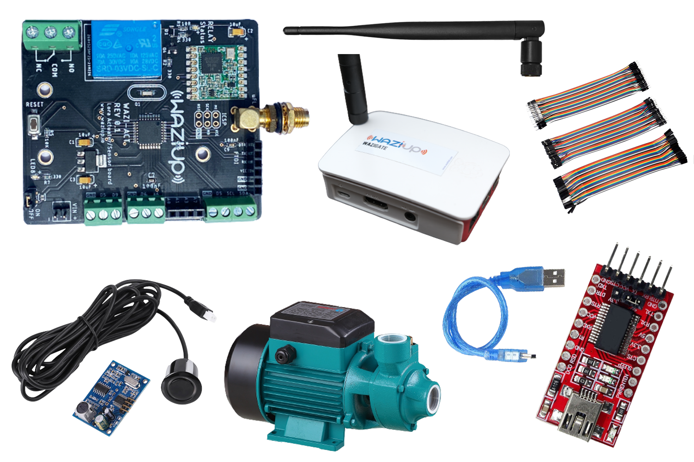

Overview
----

Its very common to see water storage tanks overflowing in most places where a pump is used. These overflows lead to wastage of water and higher electricity bills due to the water pumps running longer than necessary.

Luckily, we are in a digital age in which certain basic aspects of our daily lives can be automatated.

In this guide, we will look at how to automatically control the water level in a tank by switching the water pump ON, when the water level goes below a predetermined level. The circuit automatically switches the water pump OFF when the tank is full as well.

Here's what we will be learning:
- What parts are needed
- How to wire up and read sensor values
- How to trigger an actuator
- How to communicate to the cloud over LoRa

What parts do we need?
----

To follow this user manual, one will need the following:

Hardware
  - WaziACT
  - FTDI FT232
  - Mini USB Cable
  - Wazigate
  - SR04 Ultrasonic Sensor
  - Some Jumper Wires
  - Lora 868Mhz Antenna

Software
  - Install the [Arduino IDE](https://www.arduino.cc/en/Main/Software) for the programming aspects.
  - Install the [WaziDev](https://github.com/Waziup/WaziDev/archive/master.zip) libraries for LoRa communication. Follow the guide [here](https://waziup.io/documentation/wazidev/user-manual/#install-the-wazidev-sketchbook)
