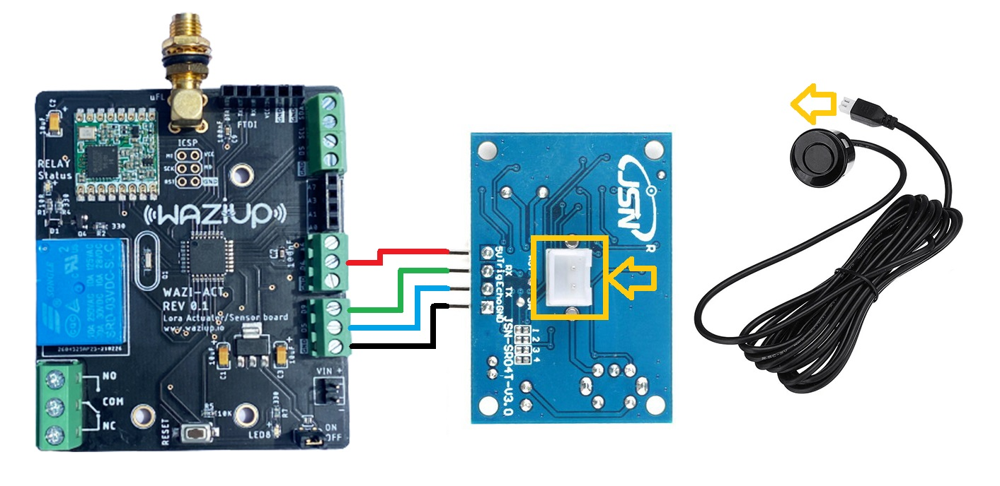
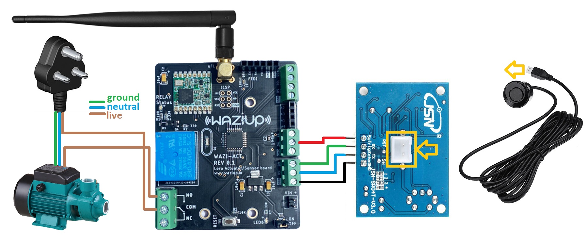
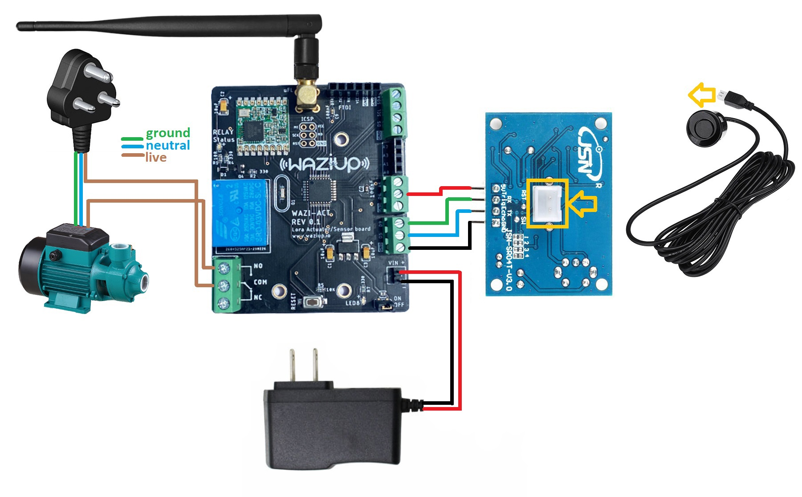
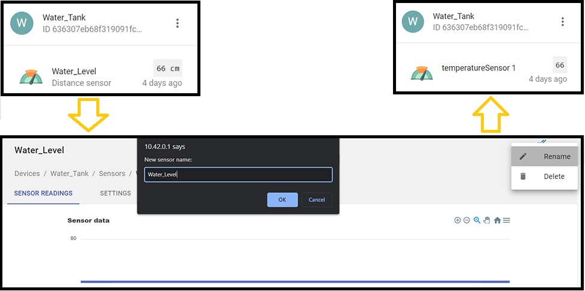
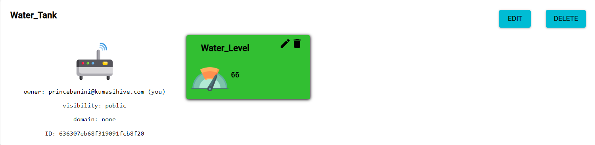
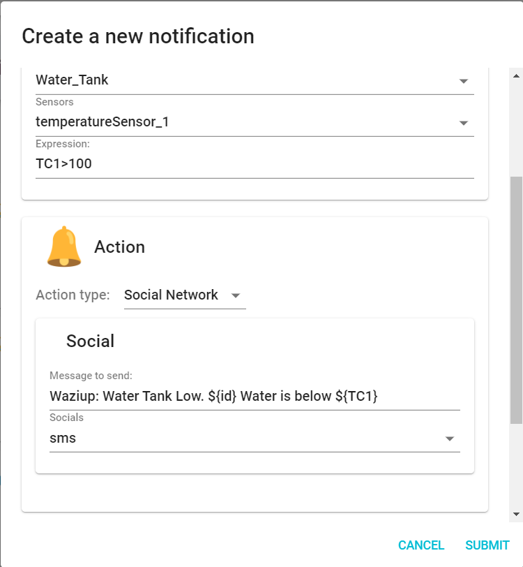

Step #1: Wiring and Reading Sensor Values
============================================

To be able to detect the current water level in the tank, we need to use the waterproof ultrasonic distance sensor.

The sensor head emits an ultrasonic wave and receives the wave reflected back from the target. The ultrasonic Sensor measures the distance to the target by measuring the time between the emission and reception of the ultrasonic signal.


Schematic
---------



**NOTE:** we used the digital pin d4 as the VCC/power source for the ultrasonic sensor. This is to enable us to switch off the sensor completely if need be in the future. Because each digital pin can handle 40mA max current draw, the 30mA operating current of the sensor wont be an issue. we can see this from the manufactureres data sheet.

Lets also note that the waterproof ultrasonic sensor we are using has a minimum range of 25cm. This means that below 25cm the sensor reading might not be accurate. However we can read up to 5 meters max. This may good enough for most use cases.


Code Sample
-----------

```c
//sensor pins
#define trigPin  9
#define echoPin  5

//sensor power pin
#define powerPin  4

void setup() {
  Serial.begin(9600);

  //turning sensor on
  pinMode(powerPin, OUTPUT);
  delay(500);
  digitalWrite(powerPin, HIGH);

  //declaring sensor pin modes
  pinMode(trigPin, OUTPUT);
  //inputpull up to prevent noise on echo pin
  pinMode(echoPin, INPUT_PULLUP);

}

void loop() {

  //reading sensor values
  unsigned long duration = 0;
  int distance = 0;
  int average = 0;

  //taking 100 distance samples
  while (average <= 100) {
    digitalWrite(trigPin, LOW);
    delayMicroseconds(5);
    digitalWrite(trigPin, HIGH);
    delayMicroseconds(10);
    digitalWrite(trigPin, LOW);

    duration = pulseIn(echoPin, HIGH, 1000);
    distance += duration * 0.034 / 2;
    average += 1;
    delay(30);
  }

  //finding the average of 100 samples
  distance = distance / average;

  //checking to be sure the current distance value is a number and greater than 0
  if (!(isnan(distance) || distance < 0)) {
    return;
  }

  Serial.print("Distance: ");
  Serial.print(distance);
  Serial.println(" cm");

  delay(10);
}
```


Step #2: Triggering an Actuator with Sensor Data
=====================================================

In our previous code snample, we were able to read sensor values. Lets now use those values to trigger the relay when the water level falls to say 100cm. We will also stop or turn off the pump when the water level rises to 30cm.

NOTE: Since AC power is involved, please make sure you're wearing protective clothing. Make sure you're qualified/certified to handle the task at hand. You are 100% responsible for your safety and well being.

Schematics
----------



Code Sample
-----------

```c
//sensor pins
#define trigPin  9
#define echoPin  5

//sensor power pin
#define powerPin  4

//relay pin
const int relayPin = 7;

void setup() {
  Serial.begin(9600);

  //turning sensor on
  pinMode(powerPin, OUTPUT);
  delay(500);
  digitalWrite(powerPin, HIGH);

  //declaring relay pin mode
  pinMode(relayPin, OUTPUT);
  delay(500);
  //make sure the relay isnt on during a restart
  digitalWrite(relayPin, LOW);
  
  //declaring sensor pin modes
  pinMode(trigPin, OUTPUT);
  //inputpull up to prevent noise on echo pin
  pinMode(echoPin, INPUT_PULLUP);

}

void loop() {

  //reading sensor values
  unsigned long duration = 0;
  int distance = 0;
  int average = 0;

  //taking 100 distance samples
  while (average <= 100) {
    digitalWrite(trigPin, LOW);
    delayMicroseconds(5);
    digitalWrite(trigPin, HIGH);
    delayMicroseconds(10);
    digitalWrite(trigPin, LOW);

    duration = pulseIn(echoPin, HIGH, 1000);
    distance += duration * 0.034 / 2;
    average += 1;
    delay(30);
  }

  //finding the average of 100 samples
  distance = distance / average;

  //checking to be sure the current distance value is a number and greater than 0
  if (!(isnan(distance) || distance < 0)) {
    return;
  }

  Serial.print("Distance: ");
  Serial.print(distance);
  Serial.println(" cm");

  //full tank value of 30cm and low value of 100cm
  if(distance < 30){//tank full
    digitalWrite(relayPin, LOW);
  }else if(distance > 100){//tank running low
    digitalWrite(relayPin, HIGH);
  }

  delay(10);
}
```


Step #3: Combining Sensing, Actuation and Lora Communication
=============================================================

At this point, we want the WaziDev to constantly update Wazicloud with the current state of the tank through Wazigate.

**NOTE:** Make sure to have a configured gateway up and running before uploading this next code. Kindly see the lectures under **Module 5 Lecture 2** for how to setup a Waziup Gateway.

In order to make our project mobile, we can add a battery to power the sensor and the Wazidev as shown below.

Schematics
----------


Code Sample
-----------

```c
#include <WaziDev.h>
#include <xlpp.h>
#include <Base64.h>

//sensor pins
#define trigPin  9
#define echoPin  5

//sensor power pin
#define powerPin  4

//relay pin
const int relayPin = 7;

// NwkSKey (Network Session Key) and Appkey (AppKey) are used for securing LoRaWAN transmissions.
// You need to copy them from/to your LoRaWAN server or gateway.
// You need to configure also the devAddr. DevAddr need to be different for each devices!!
// Copy'n'paste the DevAddr (Device Address): 26011D00
unsigned char devAddr[4] = {0x26, 0x01, 0x1D, 0x00};

// Copy'n'paste the key to your Wazigate: 23158D3BBC31E6AF670D195B5AED5525
unsigned char appSkey[16] = {0x23, 0x15, 0x8D, 0x3B, 0xBC, 0x31, 0xE6, 0xAF, 0x67, 0x0D, 0x19, 0x5B, 0x5A, 0xED, 0x55, 0x25};

// Copy'n'paste the key to your Wazigate: 23158D3BBC31E6AF670D195B5AED5525
unsigned char nwkSkey[16] = {0x23, 0x15, 0x8D, 0x3B, 0xBC, 0x31, 0xE6, 0xAF, 0x67, 0x0D, 0x19, 0x5B, 0x5A, 0xED, 0x55, 0x25};

WaziDev wazidev;

void setup()
{
  Serial.begin(38400);
  wazidev.setupLoRaWAN(devAddr, appSkey, nwkSkey);

  //turning sensor on
  pinMode(powerPin, OUTPUT);
  delay(500);
  digitalWrite(powerPin, HIGH);

  //declaring relay pin mode
  pinMode(relayPin, OUTPUT);
  delay(500);
  //make sure the relay isnt on during a restart
  digitalWrite(relayPin, LOW);

  //declaring sensor pin modes
  pinMode(trigPin, OUTPUT);

  //inputpull up to prevent noise on echo pin
  pinMode(echoPin, INPUT_PULLUP);

}

XLPP xlpp(120);

void loop(void)
{
  //reading sensor values
  unsigned long duration = 0;
  int distance = 0;
  int average = 0;

  //taking 100 distance samples
  while (average <= 100) {
    digitalWrite(trigPin, LOW);
    delayMicroseconds(5);
    digitalWrite(trigPin, HIGH);
    delayMicroseconds(10);
    digitalWrite(trigPin, LOW);

    duration = pulseIn(echoPin, HIGH, 1000);
    distance += duration * 0.034 / 2;
    average += 1;
    delay(30);
  }

  //finding the average of 100 samples
  distance = distance / average;

  //checking to be sure the current distance value is a number and greater than 0
  if (!(isnan(distance) || distance < 0)) {
    return;
  }

  Serial.print("Distance: ");
  Serial.print(distance);
  Serial.println(" cm");

  //full tank value of 30cm and low value of 100cm
  if (distance < 30) { //tank full
    digitalWrite(relayPin, LOW);
  } else if (distance > 100) { //tank running low
    digitalWrite(relayPin, HIGH);
  }

  delay(10);
  // 1
  // Create xlpp payload.

  xlpp.reset();

  xlpp.addTemperature(1, distance);

  // 2.
  // Send paload with LoRaWAN.
  serialPrintf("LoRaWAN send ... ");
  uint8_t e = wazidev.sendLoRaWAN(xlpp.buf, xlpp.len);
  if (e != 0)
  {
    serialPrintf("Err %d\n", e);
    delay(60000);
    return;
  }
  serialPrintf("OK\n");

  // 3.
  // Receive LoRaWAN message (waiting for 6 seconds only).
  serialPrintf("LoRa receive ... ");
  uint8_t offs = 0;
  long startSend = millis();
  e = wazidev.receiveLoRaWAN(xlpp.buf, &xlpp.offset, &xlpp.len, 6000);
  long endSend = millis();
  if (e != 0)
  {
    if (e == ERR_LORA_TIMEOUT) {
      serialPrintf("nothing received\n");
    }
    else
    {
      serialPrintf("Err %d\n", e);
    }
    delay(60000);
    return;
  }
  serialPrintf("OK\n");

  serialPrintf("Time On Air: %d ms\n", endSend - startSend);
  serialPrintf("LoRa SNR: %d\n", wazidev.loRaSNR);
  serialPrintf("LoRa RSSI: %d\n", wazidev.loRaRSSI);
  serialPrintf("LoRaWAN frame size: %d\n", xlpp.offset + xlpp.len);
  serialPrintf("LoRaWAN payload len: %d\n", xlpp.len);
  serialPrintf("Payload: ");
  char payload[100];
  base64_decode(payload, xlpp.getBuffer(), xlpp.len);
  serialPrintf(payload);
  serialPrintf("\n");

  delay(5000);
}
```

At this point, all we need to do is flash the above code to the WaziACT and attach the ultrasonic head to the upper part of the desired tank for sensing.

If we take a look at the data in our serial monitor we should see something similar to the image below.


Since we used `xlpp.addTemperature(1, distance);` for the distance or water level values, we have to rename the sensor on the wazigate for clarity as shown below.



If we take a look at the Wazicloud platform, we will also see the sensor value once again.



we can also setup notifications on WaziCloud, for when the water level threshold conditions are met. Kindly see the lectures under **Module 5 Lecture 3** for how to setup a Notifications on Wazicloud.


