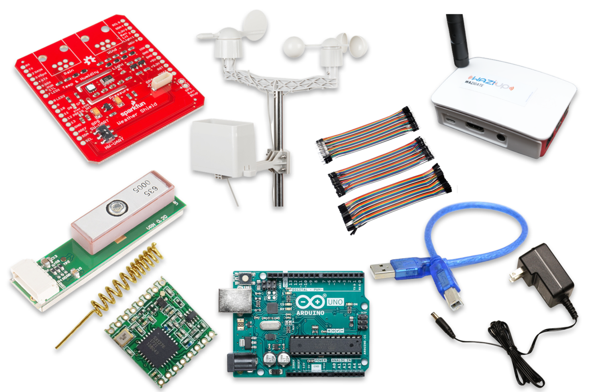
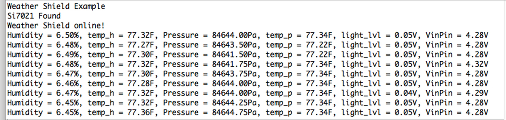

Overview
========
A weather station is a facility, either on land or sea, with instruments and equipment for measuring atmospheric conditions to provide information for weather forecasts and to study the weather and climate.

In recent years weather stations have become increasingly porpular among DIYers but the issue has always been with how to build a low-cost but functional station. In this guide, we will look at how to build a weather staion from scratch. 

We will be using The **Arduino Weather Shield** from [Sparkfun](https://learn.sparkfun.com/tutorials/arduino-weather-shield-hookup-guide-v12/all). This is an easy-to-use Arduino shield that grants you access to barometric pressure, relative humidity, luminosity, and temperature. There are also connections to optional sensors such as wind speed/direction, rain gauge, and GPS for location and super accurate timing. 

We will also use LoRa for communicating weather data to a Wazigate and then to Wazicloud.

Here's what we will be learning:
- How to read atmospheric sensor data (barometric pressure, relative humidity, luminosity, and temperature)
- How to read wind speed/direction, rain gauge, and GPS
- How to process all sensor data
- How to transmit sensor data to Wazicloud using LoRa

What parts do we need?
======================
To follow this user manual, one will need the following hardware and software:

Hardware
- SparkFun Weather Shield Kit
- SparkFun Weather Meter Kit
- Arduino Uno with USB Cable
- Lora SX1276 Breakout Board
- Waziup Gateway
- Some Jumper Wires
- Power Supply



Things you should know about the Sparkfun Weather shield:

- It Uses the [Si7021](https://www.sparkfun.com/products/13763) sensor, [MPL3115A2 barometric pressure](https://www.sparkfun.com/products/11084?_ga=2.39980774.510170626.1666488566-160177867.1666172664) sensor, and [ALS-PT19 light](https://www.sparkfun.com/products/12566?_ga=2.39980774.510170626.1666488566-160177867.1666172664) sensor.
- Has connector for the [GP-735 compact GPS module](https://www.sparkfun.com/products/13670?_ga=2.216133586.510170626.1666488566-160177867.1666172664)
- Has optional [RJ11 connector](https://www.sparkfun.com/products/132?_ga=2.203755092.510170626.1666488566-160177867.1666172664) footprints to connect the [SparkFun weather meters](https://www.sparkfun.com/products/15901)
- Weather shield can operate from 3V to 10V and has built in voltage regulators and signal translators
- Typical humidity accuracy of ±2%
- Typical pressure accuracy of ±50Pa
- Typical temperature accuracy of ±0.3C

Software
  - Install the [Arduino IDE](https://www.arduino.cc/en/Main/Software) for the programming aspects.
  - Install [TinyGPSPlus](https://github.com/mikalhart/TinyGPSPlus) library by **Mikal Hart**
  - Install the [WaziDev](https://github.com/Waziup/WaziDev/archive/master.zip) libraries for LoRa communication. Follow the guide [here](https://waziup.io/documentation/wazidev/user-manual/#install-the-wazidev-sketchbook)
  - Install [SparkFunMPL3115A2](https://github.com/sparkfun/MPL3115A2_Breakout/tree/master/Libraries/Arduino)library by **Sparkfun**
  - Install [SparkFun_Si7021_Breakout_Library](https://github.com/sparkfun/SparkFun_Si7021_Arduino_Library)library by **Sparkfun**

**Step \#1:** Assembling Weather Station
========================================

To get our weather station up and running, we need to:
- Stack the weather shield on top of the Arduino Uno as shown below. Connect the GPS module as well.


- Assemble the weather meters using the guide [here](https://learn.sparkfun.com/tutorials/weather-meter-hookup-guide) as shown below.


- Connect the weather meters to the weather shield as shown below.


**Step \#2:** Trying a Basic Weather Station
========================================

**NOTE:** Before uploading code to your Arduino with the Weather Shield attached, make sure the GPS UART switch is in the **SW-UART** position. Having the switch in the opposite position connects the GPS lines to the USB lines and may cause errors while uploading. 


Code Sample
-----------

```````c
/*
 Weather Shield Example
 By: Nathan Seidle
 SparkFun Electronics
 Date: June 10th, 2016
 License: This code is public domain but you buy me a beer if you use this and we meet someday (Beerware license).

 This example prints the current humidity, air pressure, temperature and light levels.

 The weather shield is capable of a lot. Be sure to checkout the other more advanced examples for creating
 your own weather station.

 Updated by Joel Bartlett
 03/02/2017
 Removed HTU21D code and replaced with Si7021
 */

#include <Wire.h> //I2C needed for sensors
#include "SparkFunMPL3115A2.h" //Pressure sensor - Search "SparkFun MPL3115" and install from Library Manager
#include "SparkFun_Si7021_Breakout_Library.h" //Humidity sensor - Search "SparkFun Si7021" and install from Library Manager

MPL3115A2 myPressure; //Create an instance of the pressure sensor
Weather myHumidity;//Create an instance of the humidity sensor

//Hardware pin definitions
//-=-=-=-=-=-=-=-=-=-=-=-=-=-=-=-=-=-=-=-=-=-=-=-=-=-=-=-=
const byte STAT_BLUE = 7;
const byte STAT_GREEN = 8;

const byte REFERENCE_3V3 = A3;
const byte LIGHT = A1;
const byte BATT = A2;

//Global Variables
//-=-=-=-=-=-=-=-=-=-=-=-=-=-=-=-=-=-=-=-=-=-=-=-=-=-=-=-=
long lastSecond; //The millis counter to see when a second rolls by

void setup()
{
  Serial.begin(9600);
  Serial.println("Weather Shield Example");

  pinMode(STAT_BLUE, OUTPUT); //Status LED Blue
  pinMode(STAT_GREEN, OUTPUT); //Status LED Green

  pinMode(REFERENCE_3V3, INPUT);
  pinMode(LIGHT, INPUT);

  //Configure the pressure sensor
  myPressure.begin(); // Get sensor online
  myPressure.setModeBarometer(); // Measure pressure in Pascals from 20 to 110 kPa
  myPressure.setOversampleRate(7); // Set Oversample to the recommended 128
  myPressure.enableEventFlags(); // Enable all three pressure and temp event flags

  //Configure the humidity sensor
  myHumidity.begin();

  lastSecond = millis();

  Serial.println("Weather Shield online!");
}

void loop()
{
  //Print readings every second
  if (millis() - lastSecond >= 1000)
  {
    digitalWrite(STAT_BLUE, HIGH); //Blink stat LED

    lastSecond += 1000;

    //Check Humidity Sensor
    float humidity = myHumidity.getRH();

    if (humidity == 998) //Humidty sensor failed to respond
    {
      Serial.println("I2C communication to sensors is not working. Check solder connections.");

      //Try re-initializing the I2C comm and the sensors
      myPressure.begin(); 
      myPressure.setModeBarometer();
      myPressure.setOversampleRate(7);
      myPressure.enableEventFlags();
      myHumidity.begin();
    }
    else
    {
      Serial.print("Humidity = ");
      Serial.print(humidity);
      Serial.print("%,");
      float temp_h = myHumidity.getTempF();
      Serial.print(" temp_h = ");
      Serial.print(temp_h, 2);
      Serial.print("F,");

      //Check Pressure Sensor
      float pressure = myPressure.readPressure();
      Serial.print(" Pressure = ");
      Serial.print(pressure);
      Serial.print("Pa,");

      //Check tempf from pressure sensor
      float tempf = myPressure.readTempF();
      Serial.print(" temp_p = ");
      Serial.print(tempf, 2);
      Serial.print("F,");

      //Check light sensor
      float light_lvl = get_light_level();
      Serial.print(" light_lvl = ");
      Serial.print(light_lvl);
      Serial.print("V,");

      //Check batt level
      float batt_lvl = get_battery_level();
      Serial.print(" VinPin = ");
      Serial.print(batt_lvl);
      Serial.print("V");

      Serial.println();
    }

    digitalWrite(STAT_BLUE, LOW); //Turn off stat LED
  }

  delay(100);
}

//Returns the voltage of the light sensor based on the 3.3V rail
//This allows us to ignore what VCC might be (an Arduino plugged into USB has VCC of 4.5 to 5.2V)
float get_light_level()
{
  float operatingVoltage = analogRead(REFERENCE_3V3);

  float lightSensor = analogRead(LIGHT);

  operatingVoltage = 3.3 / operatingVoltage; //The reference voltage is 3.3V

  lightSensor = operatingVoltage * lightSensor;

  return (lightSensor);
}

//Returns the voltage of the raw pin based on the 3.3V rail
//This allows us to ignore what VCC might be (an Arduino plugged into USB has VCC of 4.5 to 5.2V)
//Battery level is connected to the RAW pin on Arduino and is fed through two 5% resistors:
//3.9K on the high side (R1), and 1K on the low side (R2)
float get_battery_level()
{
  float operatingVoltage = analogRead(REFERENCE_3V3);

  float rawVoltage = analogRead(BATT);

  operatingVoltage = 3.30 / operatingVoltage; //The reference voltage is 3.3V

  rawVoltage = operatingVoltage * rawVoltage; //Convert the 0 to 1023 int to actual voltage on BATT pin

  rawVoltage *= 4.90; //(3.9k+1k)/1k - multiple BATT voltage by the voltage divider to get actual system voltage

  return (rawVoltage);
}
```````

Open the **Serial Monitor**. You should see the following output:



**Step \#2:** Trying Full Weather Station with GPS
==================================================

At this point, we can be a little more adventurous and try out all the bells and whistles of the shield. With the weather meters hooked up, we will be able to see the wind speed and direction and rain values.

Code Sample
-----------

`````c
/* 
 Weather Shield Example
 By: Nathan Seidle
 SparkFun Electronics
 Date: November 16th, 2013
 License: This code is public domain but you buy me a beer if you use this and we meet someday (Beerware license).

 Much of this is based on Mike Grusin's USB Weather Board code: https://www.sparkfun.com/products/10586

 This code reads all the various sensors (wind speed, direction, rain gauge, humidty, pressure, light, batt_lvl)
 and reports it over the serial comm port. This can be easily routed to an datalogger (such as OpenLog) or
 a wireless transmitter (such as Electric Imp).

 Measurements are reported once a second but windspeed and rain gauge are tied to interrupts that are
 calcualted at each report.

 This example code assumes the GP-735 GPS module is attached.

 Updated by Joel Bartlett
 03/02/2017
 Removed HTU21D code and replaced with Si7021
 */

#include <Wire.h> //I2C needed for sensors
#include "SparkFunMPL3115A2.h" //Pressure sensor - Search "SparkFun MPL3115" and install from Library Manager
#include "SparkFun_Si7021_Breakout_Library.h" //Humidity sensor - Search "SparkFun Si7021" and install from Library Manager
#include <SoftwareSerial.h> //Needed for GPS
#include <TinyGPS++.h> //GPS parsing - Available through the Library Manager.

TinyGPSPlus gps;

static const int RXPin = 5, TXPin = 4; //GPS is attached to pin 4(TX from GPS) and pin 5(RX into GPS)
SoftwareSerial ss(RXPin, TXPin); 

MPL3115A2 myPressure; //Create an instance of the pressure sensor
Weather myHumidity;//Create an instance of the humidity sensor

//Hardware pin definitions
//-=-=-=-=-=-=-=-=-=-=-=-=-=-=-=-=-=-=-=-=-=-=-=-=-=-=-=-=
// digital I/O pins
const byte WSPEED = 3;
const byte RAIN = 2;
const byte STAT1 = 7;
const byte STAT2 = 8;
const byte GPS_PWRCTL = 6; //Pulling this pin low puts GPS to sleep but maintains RTC and RAM

// analog I/O pins
const byte REFERENCE_3V3 = A3;
const byte LIGHT = A1;
const byte BATT = A2;
const byte WDIR = A0;
//-=-=-=-=-=-=-=-=-=-=-=-=-=-=-=-=-=-=-=-=-=-=-=-=-=-=-=-=

//Global Variables
//-=-=-=-=-=-=-=-=-=-=-=-=-=-=-=-=-=-=-=-=-=-=-=-=-=-=-=-=
long lastSecond; //The millis counter to see when a second rolls by
byte seconds; //When it hits 60, increase the current minute
byte seconds_2m; //Keeps track of the "wind speed/dir avg" over last 2 minutes array of data
byte minutes; //Keeps track of where we are in various arrays of data
byte minutes_10m; //Keeps track of where we are in wind gust/dir over last 10 minutes array of data

long lastWindCheck = 0;
volatile long lastWindIRQ = 0;
volatile byte windClicks = 0;

//We need to keep track of the following variables:
//Wind speed/dir each update (no storage)
//Wind gust/dir over the day (no storage)
//Wind speed/dir, avg over 2 minutes (store 1 per second)
//Wind gust/dir over last 10 minutes (store 1 per minute)
//Rain over the past hour (store 1 per minute)
//Total rain over date (store one per day)

byte windspdavg[120]; //120 bytes to keep track of 2 minute average
int winddiravg[120]; //120 ints to keep track of 2 minute average
float windgust_10m[10]; //10 floats to keep track of 10 minute max
int windgustdirection_10m[10]; //10 ints to keep track of 10 minute max
volatile float rainHour[60]; //60 floating numbers to keep track of 60 minutes of rain

//These are all the weather values that wunderground expects:
int winddir = 0; // [0-360 instantaneous wind direction]
float windspeedmph = 0; // [mph instantaneous wind speed]
float windgustmph = 0; // [mph current wind gust, using software specific time period]
int windgustdir = 0; // [0-360 using software specific time period]
float windspdmph_avg2m = 0; // [mph 2 minute average wind speed mph]
int winddir_avg2m = 0; // [0-360 2 minute average wind direction]
float windgustmph_10m = 0; // [mph past 10 minutes wind gust mph ]
int windgustdir_10m = 0; // [0-360 past 10 minutes wind gust direction]
float humidity = 0; // [%]
float tempf = 0; // [temperature F]
float rainin = 0; // [rain inches over the past hour)] -- the accumulated rainfall in the past 60 min
volatile float dailyrainin = 0; // [rain inches so far today in local time]
//float baromin = 30.03;// [barom in] - It's hard to calculate baromin locally, do this in the agent
float pressure = 0;
//float dewptf; // [dewpoint F] - It's hard to calculate dewpoint locally, do this in the agent

float batt_lvl = 11.8; //[analog value from 0 to 1023]
float light_lvl = 455; //[analog value from 0 to 1023]

//Variables used for GPS
//float flat, flon; // 39.015024 -102.283608686
//unsigned long age;
//int year;
//byte month, day, hour, minute, second, hundredths;

// volatiles are subject to modification by IRQs
volatile unsigned long raintime, rainlast, raininterval, rain;

//-=-=-=-=-=-=-=-=-=-=-=-=-=-=-=-=-=-=-=-=-=-=-=-=-=-=-=-=

//Interrupt routines (these are called by the hardware interrupts, not by the main code)
//-=-=-=-=-=-=-=-=-=-=-=-=-=-=-=-=-=-=-=-=-=-=-=-=-=-=-=-=
void rainIRQ()
// Count rain gauge bucket tips as they occur
// Activated by the magnet and reed switch in the rain gauge, attached to input D2
{
  raintime = millis(); // grab current time
  raininterval = raintime - rainlast; // calculate interval between this and last event

    if (raininterval > 10) // ignore switch-bounce glitches less than 10mS after initial edge
  {
    dailyrainin += 0.011; //Each dump is 0.011" of water
    rainHour[minutes] += 0.011; //Increase this minute's amount of rain

    rainlast = raintime; // set up for next event
  }
}

void wspeedIRQ()
// Activated by the magnet in the anemometer (2 ticks per rotation), attached to input D3
{
  if (millis() - lastWindIRQ > 10) // Ignore switch-bounce glitches less than 10ms (142MPH max reading) after the reed switch closes
  {
    lastWindIRQ = millis(); //Grab the current time
    windClicks++; //There is 1.492MPH for each click per second.
  }
}


void setup()
{
  Serial.begin(9600);
  Serial.println("Weather Shield Example");

  ss.begin(9600); //Begin listening to GPS over software serial at 9600. This should be the default baud of the module.

  pinMode(STAT1, OUTPUT); //Status LED Blue
  pinMode(STAT2, OUTPUT); //Status LED Green

  pinMode(GPS_PWRCTL, OUTPUT);
  digitalWrite(GPS_PWRCTL, HIGH); //Pulling this pin low puts GPS to sleep but maintains RTC and RAM

  pinMode(WSPEED, INPUT_PULLUP); // input from wind meters windspeed sensor
  pinMode(RAIN, INPUT_PULLUP); // input from wind meters rain gauge sensor

  pinMode(REFERENCE_3V3, INPUT);
  pinMode(LIGHT, INPUT);

  //Configure the pressure sensor
  myPressure.begin(); // Get sensor online
  myPressure.setModeBarometer(); // Measure pressure in Pascals from 20 to 110 kPa
  myPressure.setOversampleRate(7); // Set Oversample to the recommended 128
  myPressure.enableEventFlags(); // Enable all three pressure and temp event flags 

  //Configure the humidity sensor
  myHumidity.begin();

  seconds = 0;
  lastSecond = millis();

  // attach external interrupt pins to IRQ functions
  attachInterrupt(0, rainIRQ, FALLING);
  attachInterrupt(1, wspeedIRQ, FALLING);

  // turn on interrupts
  interrupts();

  Serial.println("Weather Shield online!");

}

void loop()
{
  //Keep track of which minute it is
  if(millis() - lastSecond >= 1000)
  {
    digitalWrite(STAT1, HIGH); //Blink stat LED

    lastSecond += 1000;

    //Take a speed and direction reading every second for 2 minute average
    if(++seconds_2m > 119) seconds_2m = 0;

    //Calc the wind speed and direction every second for 120 second to get 2 minute average
    float currentSpeed = get_wind_speed();
    windspeedmph = currentSpeed; //update global variable for windspeed when using the printWeather() function
    //float currentSpeed = random(5); //For testing
    int currentDirection = get_wind_direction();
    windspdavg[seconds_2m] = (int)currentSpeed;
    winddiravg[seconds_2m] = currentDirection;
    //if(seconds_2m % 10 == 0) displayArrays(); //For testing

    //Check to see if this is a gust for the minute
    if(currentSpeed > windgust_10m[minutes_10m])
    {
      windgust_10m[minutes_10m] = currentSpeed;
      windgustdirection_10m[minutes_10m] = currentDirection;
    }

    //Check to see if this is a gust for the day
    if(currentSpeed > windgustmph)
    {
      windgustmph = currentSpeed;
      windgustdir = currentDirection;
    }

    if(++seconds > 59)
    {
      seconds = 0;

      if(++minutes > 59) minutes = 0;
      if(++minutes_10m > 9) minutes_10m = 0;

      rainHour[minutes] = 0; //Zero out this minute's rainfall amount
      windgust_10m[minutes_10m] = 0; //Zero out this minute's gust
    }

    //Report all readings every second
    printWeather();

    digitalWrite(STAT1, LOW); //Turn off stat LED
  }

  //smartdelay(800); //Wait 1 second, and gather GPS data
}

//While we delay for a given amount of time, gather GPS data
static void smartdelay(unsigned long ms)
{
  unsigned long start = millis();
  do 
  {
    while (ss.available())
      gps.encode(ss.read());
  } while (millis() - start < ms);
}


//Calculates each of the variables that wunderground is expecting
void calcWeather()
{
  //Calc winddir
  winddir = get_wind_direction();

  //Calc windspeed
  //windspeedmph = get_wind_speed(); //This is calculated in the main loop on line 196

  //Calc windgustmph
  //Calc windgustdir
  //Report the largest windgust today
  //windgustmph = 0;
  //windgustdir = 0;

  //Calc windspdmph_avg2m
  float temp = 0;
  for(int i = 0 ; i < 120 ; i++)
    temp += windspdavg[i];
  temp /= 120.0;
  windspdmph_avg2m = temp;

  //Calc winddir_avg2m
  temp = 0; //Can't use winddir_avg2m because it's an int
  for(int i = 0 ; i < 120 ; i++)
    temp += winddiravg[i];
  temp /= 120;
  winddir_avg2m = temp;

  //Calc windgustmph_10m
  //Calc windgustdir_10m
  //Find the largest windgust in the last 10 minutes
  windgustmph_10m = 0;
  windgustdir_10m = 0;
  //Step through the 10 minutes  
  for(int i = 0; i < 10 ; i++)
  {
    if(windgust_10m[i] > windgustmph_10m)
    {
      windgustmph_10m = windgust_10m[i];
      windgustdir_10m = windgustdirection_10m[i];
    }
  }

  //Calc humidity
  humidity = myHumidity.getRH();
  //float temp_h = myHumidity.readTemperature();
  //Serial.print(" TempH:");
  //Serial.print(temp_h, 2);

  //Calc tempf from pressure sensor
  tempf = myPressure.readTempF();
  //Serial.print(" TempP:");
  //Serial.print(tempf, 2);

  //Total rainfall for the day is calculated within the interrupt
  //Calculate amount of rainfall for the last 60 minutes
  rainin = 0;  
  for(int i = 0 ; i < 60 ; i++)
    rainin += rainHour[i];

  //Calc pressure
  pressure = myPressure.readPressure();

  //Calc dewptf

  //Calc light level
  light_lvl = get_light_level();

  //Calc battery level
  batt_lvl = get_battery_level();

}

//Returns the voltage of the light sensor based on the 3.3V rail
//This allows us to ignore what VCC might be (an Arduino plugged into USB has VCC of 4.5 to 5.2V)
float get_light_level()
{
  float operatingVoltage = analogRead(REFERENCE_3V3);

  float lightSensor = analogRead(LIGHT);

  operatingVoltage = 3.3 / operatingVoltage; //The reference voltage is 3.3V

  lightSensor = operatingVoltage * lightSensor;

  return(lightSensor);
}

//Returns the voltage of the raw pin based on the 3.3V rail
//This allows us to ignore what VCC might be (an Arduino plugged into USB has VCC of 4.5 to 5.2V)
//Battery level is connected to the RAW pin on Arduino and is fed through two 5% resistors:
//3.9K on the high side (R1), and 1K on the low side (R2)
float get_battery_level()
{
  float operatingVoltage = analogRead(REFERENCE_3V3);

  float rawVoltage = analogRead(BATT);

  operatingVoltage = 3.30 / operatingVoltage; //The reference voltage is 3.3V

  rawVoltage = operatingVoltage * rawVoltage; //Convert the 0 to 1023 int to actual voltage on BATT pin

  rawVoltage *= 4.90; //(3.9k+1k)/1k - multiple BATT voltage by the voltage divider to get actual system voltage

  return(rawVoltage);
}

//Returns the instataneous wind speed
float get_wind_speed()
{
  float deltaTime = millis() - lastWindCheck; //750ms

  deltaTime /= 1000.0; //Covert to seconds

  float windSpeed = (float)windClicks / deltaTime; //3 / 0.750s = 4

  windClicks = 0; //Reset and start watching for new wind
  lastWindCheck = millis();

  windSpeed *= 1.492; //4 * 1.492 = 5.968MPH

  /* Serial.println();
   Serial.print("Windspeed:");
   Serial.println(windSpeed);*/

  return(windSpeed);
}

//Read the wind direction sensor, return heading in degrees
int get_wind_direction() 
{
  unsigned int adc;

  adc = analogRead(WDIR); // get the current reading from the sensor

  // The following table is ADC readings for the wind direction sensor output, sorted from low to high.
  // Each threshold is the midpoint between adjacent headings. The output is degrees for that ADC reading.
  // Note that these are not in compass degree order! See Weather Meters datasheet for more information.

  if (adc < 380) return (113);
  if (adc < 393) return (68);
  if (adc < 414) return (90);
  if (adc < 456) return (158);
  if (adc < 508) return (135);
  if (adc < 551) return (203);
  if (adc < 615) return (180);
  if (adc < 680) return (23);
  if (adc < 746) return (45);
  if (adc < 801) return (248);
  if (adc < 833) return (225);
  if (adc < 878) return (338);
  if (adc < 913) return (0);
  if (adc < 940) return (293);
  if (adc < 967) return (315);
  if (adc < 990) return (270);
  return (-1); // error, disconnected?
}


//Prints the various variables directly to the port
//I don't like the way this function is written but Arduino doesn't support floats under sprintf
void printWeather()
{
  calcWeather(); //Go calc all the various sensors

  Serial.println();
  Serial.print("$,winddir=");
  Serial.print(winddir);
  Serial.print(",windspeedmph=");
  Serial.print(windspeedmph, 1);
  /*Serial.print(",windgustmph=");
  Serial.print(windgustmph, 1);
  Serial.print(",windgustdir=");
  Serial.print(windgustdir);
  Serial.print(",windspdmph_avg2m=");
  Serial.print(windspdmph_avg2m, 1);
  Serial.print(",winddir_avg2m=");
  Serial.print(winddir_avg2m);
  Serial.print(",windgustmph_10m=");
  Serial.print(windgustmph_10m, 1);
  Serial.print(",windgustdir_10m=");
  Serial.print(windgustdir_10m);*/
  Serial.print(",humidity=");
  Serial.print(humidity, 1);
  Serial.print(",tempf=");
  Serial.print(tempf, 1);
  Serial.print(",rainin=");
  Serial.print(rainin, 2);
  Serial.print(",dailyrainin=");
  Serial.print(dailyrainin, 2);
  Serial.print(",pressure=");
  Serial.print(pressure, 2);
  Serial.print(",batt_lvl=");
  Serial.print(batt_lvl, 2);
  Serial.print(",light_lvl=");
  Serial.print(light_lvl, 2);

  Serial.print(",lat=");
  Serial.print(gps.location.lat(), 6);
  Serial.print(",lng=");
  Serial.print(gps.location.lng(), 6);
  Serial.print(",altitude=");
  Serial.print(gps.altitude.meters());
  Serial.print(",sats=");
  Serial.print(gps.satellites.value());

  char sz[32];
  Serial.print(",date=");
  sprintf(sz, "%02d/%02d/%02d", gps.date.month(), gps.date.day(), gps.date.year());
  Serial.print(sz);

  Serial.print(",time=");
  sprintf(sz, "%02d:%02d:%02d", gps.time.hour(), gps.time.minute(), gps.time.second());
  Serial.print(sz);

  Serial.print(",");
  Serial.println("#");

}

`````

Open the **Serial Monitor**. You should see more data than we saw in the previous basic example:


**Note:** The `batt_lvl` is indicating 4.32V. This is correct and is the actual voltage read from the Arduino powered over USB. The GPS module will add 50-80mA to the overall power consumption. The Weather Shield runs at 3.3V and the Arduino will continue to run just fine down to about 3V. The reading is very helpful for monitoring your power source (USB, battery, solar, etc).

**Step \#3:** Weather Station with LoRa
=======================================

To use LoRa for communication, we need to make a little modification to the code in previous example and wire up the SX1276 module to the sparkfun weather shield.

Schematic
---------


Code Sample
-----------

`````c
#include <Wire.h> //I2C needed for sensors
#include "SparkFunMPL3115A2.h" //Pressure sensor - Search "SparkFun MPL3115" and install from Library Manager
#include "SparkFun_Si7021_Breakout_Library.h" //Humidity sensor - Search "SparkFun Si7021" and install from Library Manager
#include <SoftwareSerial.h> //Needed for GPS
#include <TinyGPS++.h> //GPS parsing - Available through the Library Manager.
#include <WaziDev.h>
#include <xlpp.h>
#include <Base64.h>

// NwkSKey (Network Session Key) and Appkey (AppKey) are used for securing LoRaWAN transmissions.
// You need to copy them from/to your LoRaWAN server or gateway.
// You need to configure also the devAddr. DevAddr need to be different for each devices!!
// Copy'n'paste the DevAddr (Device Address): 26011D00
unsigned char devAddr[4] = {0x26, 0x01, 0x1D, 0x00};

// Copy'n'paste the key to your Wazigate: 23158D3BBC31E6AF670D195B5AED5525
unsigned char appSkey[16] = {0x23, 0x15, 0x8D, 0x3B, 0xBC, 0x31, 0xE6, 0xAF, 0x67, 0x0D, 0x19, 0x5B, 0x5A, 0xED, 0x55, 0x25};

// Copy'n'paste the key to your Wazigate: 23158D3BBC31E6AF670D195B5AED5525
unsigned char nwkSkey[16] = {0x23, 0x15, 0x8D, 0x3B, 0xBC, 0x31, 0xE6, 0xAF, 0x67, 0x0D, 0x19, 0x5B, 0x5A, 0xED, 0x55, 0x25};

WaziDev wazidev;

TinyGPSPlus gps;

static const int RXPin = 5, TXPin = 4; //GPS is attached to pin 4(TX from GPS) and pin 5(RX into GPS)
SoftwareSerial ss(RXPin, TXPin);

MPL3115A2 myPressure; //Create an instance of the pressure sensor
Weather myHumidity;//Create an instance of the humidity sensor

//Hardware pin definitions
//-=-=-=-=-=-=-=-=-=-=-=-=-=-=-=-=-=-=-=-=-=-=-=-=-=-=-=-=
// digital I/O pins
const byte WSPEED = 3;
const byte RAIN = A4; //we used pin 2 for the sx1276 so we changes to A4
const byte STAT1 = 7;
const byte STAT2 = 8;
const byte GPS_PWRCTL = 6; //Pulling this pin low puts GPS to sleep but maintains RTC and RAM

// analog I/O pins
const byte REFERENCE_3V3 = A3;
const byte LIGHT = A1;
const byte BATT = A2;
const byte WDIR = A0;
//-=-=-=-=-=-=-=-=-=-=-=-=-=-=-=-=-=-=-=-=-=-=-=-=-=-=-=-=

//Global Variables
//-=-=-=-=-=-=-=-=-=-=-=-=-=-=-=-=-=-=-=-=-=-=-=-=-=-=-=-=
long lastSecond; //The millis counter to see when a second rolls by
byte seconds; //When it hits 60, increase the current minute
byte seconds_2m; //Keeps track of the "wind speed/dir avg" over last 2 minutes array of data
byte minutes; //Keeps track of where we are in various arrays of data
byte minutes_10m; //Keeps track of where we are in wind gust/dir over last 10 minutes array of data

long lastWindCheck = 0;
volatile long lastWindIRQ = 0;
volatile byte windClicks = 0;

//We need to keep track of the following variables:
//Wind speed/dir each update (no storage)
//Wind gust/dir over the day (no storage)
//Wind speed/dir, avg over 2 minutes (store 1 per second)
//Wind gust/dir over last 10 minutes (store 1 per minute)
//Rain over the past hour (store 1 per minute)
//Total rain over date (store one per day)

byte windspdavg[120]; //120 bytes to keep track of 2 minute average
int winddiravg[120]; //120 ints to keep track of 2 minute average
float windgust_10m[10]; //10 floats to keep track of 10 minute max
int windgustdirection_10m[10]; //10 ints to keep track of 10 minute max
volatile float rainHour[60]; //60 floating numbers to keep track of 60 minutes of rain

//These are all the weather values that wunderground expects:
int winddir = 0; // [0-360 instantaneous wind direction]
float windspeedmph = 0; // [mph instantaneous wind speed]
float windgustmph = 0; // [mph current wind gust, using software specific time period]
int windgustdir = 0; // [0-360 using software specific time period]
float windspdmph_avg2m = 0; // [mph 2 minute average wind speed mph]
int winddir_avg2m = 0; // [0-360 2 minute average wind direction]
float windgustmph_10m = 0; // [mph past 10 minutes wind gust mph ]
int windgustdir_10m = 0; // [0-360 past 10 minutes wind gust direction]
float humidity = 0; // [%]
float tempf = 0; // [temperature F]
float rainin = 0; // [rain inches over the past hour)] -- the accumulated rainfall in the past 60 min
volatile float dailyrainin = 0; // [rain inches so far today in local time]
//float baromin = 30.03;// [barom in] - It's hard to calculate baromin locally, do this in the agent
float pressure = 0;
//float dewptf; // [dewpoint F] - It's hard to calculate dewpoint locally, do this in the agent

float batt_lvl = 11.8; //[analog value from 0 to 1023]
float light_lvl = 455; //[analog value from 0 to 1023]

//Variables used for GPS
//float flat, flon; // 39.015024 -102.283608686
//unsigned long age;
//int year;
//byte month, day, hour, minute, second, hundredths;

// volatiles are subject to modification by IRQs
volatile unsigned long raintime, rainlast, raininterval, rain;

//-=-=-=-=-=-=-=-=-=-=-=-=-=-=-=-=-=-=-=-=-=-=-=-=-=-=-=-=

//Interrupt routines (these are called by the hardware interrupts, not by the main code)
//-=-=-=-=-=-=-=-=-=-=-=-=-=-=-=-=-=-=-=-=-=-=-=-=-=-=-=-=
void rainIRQ()
// Count rain gauge bucket tips as they occur
// Activated by the magnet and reed switch in the rain gauge, attached to input D2
{
  raintime = millis(); // grab current time
  raininterval = raintime - rainlast; // calculate interval between this and last event

  if (raininterval > 10) // ignore switch-bounce glitches less than 10mS after initial edge
  {
    dailyrainin += 0.011; //Each dump is 0.011" of water
    rainHour[minutes] += 0.011; //Increase this minute's amount of rain

    rainlast = raintime; // set up for next event
  }
}

void wspeedIRQ()
// Activated by the magnet in the anemometer (2 ticks per rotation), attached to input D3
{
  if (millis() - lastWindIRQ > 10) // Ignore switch-bounce glitches less than 10ms (142MPH max reading) after the reed switch closes
  {
    lastWindIRQ = millis(); //Grab the current time
    windClicks++; //There is 1.492MPH for each click per second.
  }
}


void setup()
{
  Serial.begin(9600);

  wazidev.setupLoRaWAN(devAddr, appSkey, nwkSkey);

  Serial.println("Weather Shield Example");

  ss.begin(9600); //Begin listening to GPS over software serial at 9600. This should be the default baud of the module.

  pinMode(STAT1, OUTPUT); //Status LED Blue
  pinMode(STAT2, OUTPUT); //Status LED Green

  pinMode(GPS_PWRCTL, OUTPUT);
  digitalWrite(GPS_PWRCTL, HIGH); //Pulling this pin low puts GPS to sleep but maintains RTC and RAM

  pinMode(WSPEED, INPUT_PULLUP); // input from wind meters windspeed sensor
  pinMode(RAIN, INPUT_PULLUP); // input from wind meters rain gauge sensor

  pinMode(REFERENCE_3V3, INPUT);
  pinMode(LIGHT, INPUT);

  //Configure the pressure sensor
  myPressure.begin(); // Get sensor online
  myPressure.setModeBarometer(); // Measure pressure in Pascals from 20 to 110 kPa
  myPressure.setOversampleRate(7); // Set Oversample to the recommended 128
  myPressure.enableEventFlags(); // Enable all three pressure and temp event flags

  //Configure the humidity sensor
  myHumidity.begin();

  seconds = 0;
  lastSecond = millis();

  // attach external interrupt pins to IRQ functions
  attachInterrupt(0, rainIRQ, FALLING);
  attachInterrupt(1, wspeedIRQ, FALLING);

  // turn on interrupts
  interrupts();

  Serial.println("Weather Shield online!");

}

XLPP xlpp(120);

void loop()
{
  //Keep track of which minute it is
  if (millis() - lastSecond >= 1000)
  {
    digitalWrite(STAT1, HIGH); //Blink stat LED

    lastSecond += 1000;

    //Take a speed and direction reading every second for 2 minute average
    if (++seconds_2m > 119) seconds_2m = 0;

    //Calc the wind speed and direction every second for 120 second to get 2 minute average
    float currentSpeed = get_wind_speed();
    windspeedmph = currentSpeed; //update global variable for windspeed when using the printWeather() function
    //float currentSpeed = random(5); //For testing
    int currentDirection = get_wind_direction();
    windspdavg[seconds_2m] = (int)currentSpeed;
    winddiravg[seconds_2m] = currentDirection;
    //if(seconds_2m % 10 == 0) displayArrays(); //For testing

    //Check to see if this is a gust for the minute
    if (currentSpeed > windgust_10m[minutes_10m])
    {
      windgust_10m[minutes_10m] = currentSpeed;
      windgustdirection_10m[minutes_10m] = currentDirection;
    }

    //Check to see if this is a gust for the day
    if (currentSpeed > windgustmph)
    {
      windgustmph = currentSpeed;
      windgustdir = currentDirection;
    }

    if (++seconds > 59)
    {
      seconds = 0;

      if (++minutes > 59) minutes = 0;
      if (++minutes_10m > 9) minutes_10m = 0;

      rainHour[minutes] = 0; //Zero out this minute's rainfall amount
      windgust_10m[minutes_10m] = 0; //Zero out this minute's gust
    }

    //Report all readings every second
    printWeather();

    digitalWrite(STAT1, LOW); //Turn off stat LED
  }

  //smartdelay(800); //Wait 1 second, and gather GPS data
}

//While we delay for a given amount of time, gather GPS data
static void smartdelay(unsigned long ms)
{
  unsigned long start = millis();
  do
  {
    while (ss.available())
      gps.encode(ss.read());
  } while (millis() - start < ms);
}


//Calculates each of the variables that wunderground is expecting
void calcWeather()
{
  //Calc winddir
  winddir = get_wind_direction();

  //Calc windspeed
  //windspeedmph = get_wind_speed(); //This is calculated in the main loop on line 196

  //Calc windgustmph
  //Calc windgustdir
  //Report the largest windgust today
  //windgustmph = 0;
  //windgustdir = 0;

  //Calc windspdmph_avg2m
  float temp = 0;
  for (int i = 0 ; i < 120 ; i++)
    temp += windspdavg[i];
  temp /= 120.0;
  windspdmph_avg2m = temp;

  //Calc winddir_avg2m
  temp = 0; //Can't use winddir_avg2m because it's an int
  for (int i = 0 ; i < 120 ; i++)
    temp += winddiravg[i];
  temp /= 120;
  winddir_avg2m = temp;

  //Calc windgustmph_10m
  //Calc windgustdir_10m
  //Find the largest windgust in the last 10 minutes
  windgustmph_10m = 0;
  windgustdir_10m = 0;
  //Step through the 10 minutes
  for (int i = 0; i < 10 ; i++)
  {
    if (windgust_10m[i] > windgustmph_10m)
    {
      windgustmph_10m = windgust_10m[i];
      windgustdir_10m = windgustdirection_10m[i];
    }
  }

  //Calc humidity
  humidity = myHumidity.getRH();
  //float temp_h = myHumidity.readTemperature();
  //Serial.print(" TempH:");
  //Serial.print(temp_h, 2);

  //Calc tempf from pressure sensor
  tempf = myPressure.readTempF();
  //Serial.print(" TempP:");
  //Serial.print(tempf, 2);

  //Total rainfall for the day is calculated within the interrupt
  //Calculate amount of rainfall for the last 60 minutes
  rainin = 0;
  for (int i = 0 ; i < 60 ; i++)
    rainin += rainHour[i];

  //Calc pressure
  pressure = myPressure.readPressure();

  //Calc dewptf

  //Calc light level
  light_lvl = get_light_level();

  //Calc battery level
  batt_lvl = get_battery_level();

}

//Returns the voltage of the light sensor based on the 3.3V rail
//This allows us to ignore what VCC might be (an Arduino plugged into USB has VCC of 4.5 to 5.2V)
float get_light_level()
{
  float operatingVoltage = analogRead(REFERENCE_3V3);

  float lightSensor = analogRead(LIGHT);

  operatingVoltage = 3.3 / operatingVoltage; //The reference voltage is 3.3V

  lightSensor = operatingVoltage * lightSensor;

  return (lightSensor);
}

//Returns the voltage of the raw pin based on the 3.3V rail
//This allows us to ignore what VCC might be (an Arduino plugged into USB has VCC of 4.5 to 5.2V)
//Battery level is connected to the RAW pin on Arduino and is fed through two 5% resistors:
//3.9K on the high side (R1), and 1K on the low side (R2)
float get_battery_level()
{
  float operatingVoltage = analogRead(REFERENCE_3V3);

  float rawVoltage = analogRead(BATT);

  operatingVoltage = 3.30 / operatingVoltage; //The reference voltage is 3.3V

  rawVoltage = operatingVoltage * rawVoltage; //Convert the 0 to 1023 int to actual voltage on BATT pin

  rawVoltage *= 4.90; //(3.9k+1k)/1k - multiple BATT voltage by the voltage divider to get actual system voltage

  return (rawVoltage);
}

//Returns the instataneous wind speed
float get_wind_speed()
{
  float deltaTime = millis() - lastWindCheck; //750ms

  deltaTime /= 1000.0; //Covert to seconds

  float windSpeed = (float)windClicks / deltaTime; //3 / 0.750s = 4

  windClicks = 0; //Reset and start watching for new wind
  lastWindCheck = millis();

  windSpeed *= 1.492; //4 * 1.492 = 5.968MPH

  /* Serial.println();
    Serial.print("Windspeed:");
    Serial.println(windSpeed);*/

  return (windSpeed);
}

//Read the wind direction sensor, return heading in degrees
int get_wind_direction()
{
  unsigned int adc;

  adc = analogRead(WDIR); // get the current reading from the sensor

  // The following table is ADC readings for the wind direction sensor output, sorted from low to high.
  // Each threshold is the midpoint between adjacent headings. The output is degrees for that ADC reading.
  // Note that these are not in compass degree order! See Weather Meters datasheet for more information.

  if (adc < 380) return (113);
  if (adc < 393) return (68);
  if (adc < 414) return (90);
  if (adc < 456) return (158);
  if (adc < 508) return (135);
  if (adc < 551) return (203);
  if (adc < 615) return (180);
  if (adc < 680) return (23);
  if (adc < 746) return (45);
  if (adc < 801) return (248);
  if (adc < 833) return (225);
  if (adc < 878) return (338);
  if (adc < 913) return (0);
  if (adc < 940) return (293);
  if (adc < 967) return (315);
  if (adc < 990) return (270);
  return (-1); // error, disconnected?
}


//Prints the various variables directly to the port
//I don't like the way this function is written but Arduino doesn't support floats under sprintf
void printWeather()
{
  calcWeather(); //Go calc all the various sensors

  /*
    Serial.println();
    Serial.print("$,winddir=");
    Serial.print(winddir);
    Serial.print(",windspeedmph=");
    Serial.print(windspeedmph, 1);
    Serial.print(",windgustmph=");
    Serial.print(windgustmph, 1);
    Serial.print(",windgustdir=");
    Serial.print(windgustdir);
    Serial.print(",windspdmph_avg2m=");
    Serial.print(windspdmph_avg2m, 1);
    Serial.print(",winddir_avg2m=");
    Serial.print(winddir_avg2m);
    Serial.print(",windgustmph_10m=");
    Serial.print(windgustmph_10m, 1);
    Serial.print(",windgustdir_10m=");
    Serial.print(windgustdir_10m);
    Serial.print(",humidity=");
    Serial.print(humidity, 1);
    Serial.print(",tempf=");
    Serial.print(tempf, 1);
    Serial.print(",rainin=");
    Serial.print(rainin, 2);
    Serial.print(",dailyrainin=");
    Serial.print(dailyrainin, 2);
    Serial.print(",pressure=");
    Serial.print(pressure, 2);
    Serial.print(",batt_lvl=");
    Serial.print(batt_lvl, 2);
    Serial.print(",light_lvl=");
    Serial.print(light_lvl, 2);

    Serial.print(",lat=");
    Serial.print(gps.location.lat(), 6);
    Serial.print(",lng=");
    Serial.print(gps.location.lng(), 6);
    Serial.print(",altitude=");
    Serial.print(gps.altitude.meters());
    Serial.print(",sats=");
    Serial.print(gps.satellites.value());

    char sz[32];
    Serial.print(",date=");
    sprintf(sz, "%02d/%02d/%02d", gps.date.month(), gps.date.day(), gps.date.year());
    Serial.print(sz);

    Serial.print(",time=");
    sprintf(sz, "%02d:%02d:%02d", gps.time.hour(), gps.time.minute(), gps.time.second());
    Serial.print(sz);

    Serial.print(",");
    Serial.println("#");
  */

  // 1
  // Create xlpp payload.

  xlpp.reset();

  xlpp.addTemperature(1, tempf);
  xlpp.addRelativeHumidity(1, humidity);
  xlpp.addTemperature(2, winddir);
  xlpp.addTemperature(3, windspeedmph);
  xlpp.addTemperature(4, rainin);
  xlpp.addTemperature(5, dailyrainin);
  xlpp.addTemperature(6, pressure);
  xlpp.addTemperature(7, batt_lvl);
  xlpp.addTemperature(7, light_lvl);
  xlpp.addGPS(1, gps.location.lat() , gps.location.lng(), gps.altitude.meters() );

  // 2.
  // Send paload with LoRaWAN.
  serialPrintf("LoRaWAN send ... ");
  uint8_t e = wazidev.sendLoRaWAN(xlpp.buf, xlpp.len);
  if (e != 0)
  {
    serialPrintf("Err %d\n", e);
    delay(60000);
    return;
  }
  serialPrintf("OK\n");

  // 3.
  // Receive LoRaWAN message (waiting for 6 seconds only).
  serialPrintf("LoRa receive ... ");
  uint8_t offs = 0;
  long startSend = millis();
  e = wazidev.receiveLoRaWAN(xlpp.buf, &xlpp.offset, &xlpp.len, 6000);
  long endSend = millis();
  if (e != 0)
  {
    if (e == ERR_LORA_TIMEOUT) {
      serialPrintf("nothing received\n");
    }
    else
    {
      serialPrintf("Err %d\n", e);
    }
    delay(60000);
    return;
  }
  serialPrintf("OK\n");

  serialPrintf("Time On Air: %d ms\n", endSend - startSend);
  serialPrintf("LoRa SNR: %d\n", wazidev.loRaSNR);
  serialPrintf("LoRa RSSI: %d\n", wazidev.loRaRSSI);
  serialPrintf("LoRaWAN frame size: %d\n", xlpp.offset + xlpp.len);
  serialPrintf("LoRaWAN payload len: %d\n", xlpp.len);
  serialPrintf("Payload: ");
  char payload[100];
  base64_decode(payload, xlpp.getBuffer(), xlpp.len);
  serialPrintf(payload);
  serialPrintf("\n");

}

`````
After uploading the above code sample, we should see our weather data arrive on the gateway and wazicloud.

**NOTE:** Even though we used `xlpp.addTemperature()` for most of the sensors, we can simply rename them on the gateway to their desired names.

We can also setup notification on wazicloud, for when certain conditions are met. For example when `bat_lvl` is below 3.0v

Kindly see Module 5 Lecture 3 for details on how to setup notifications on Wazicloud.

Cheers!!